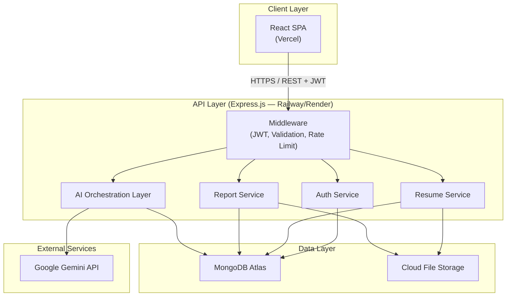
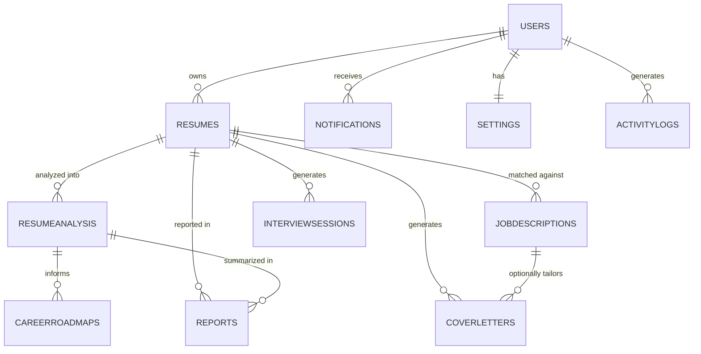
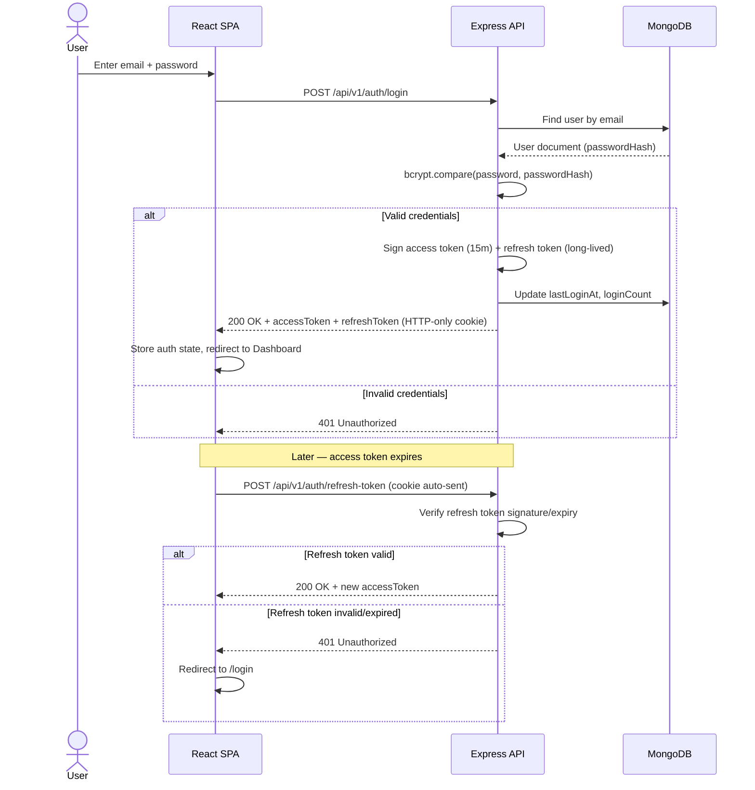
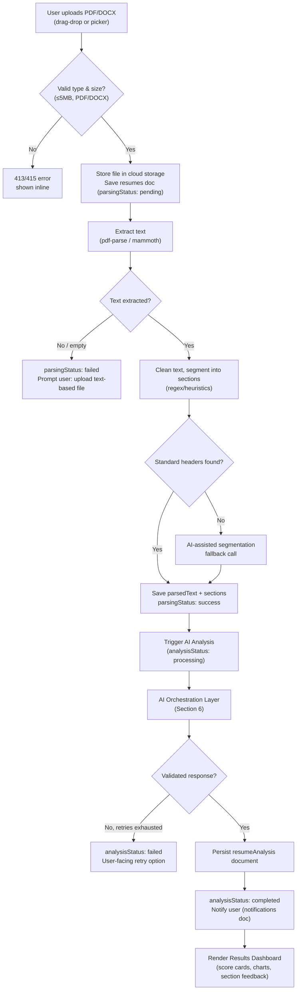
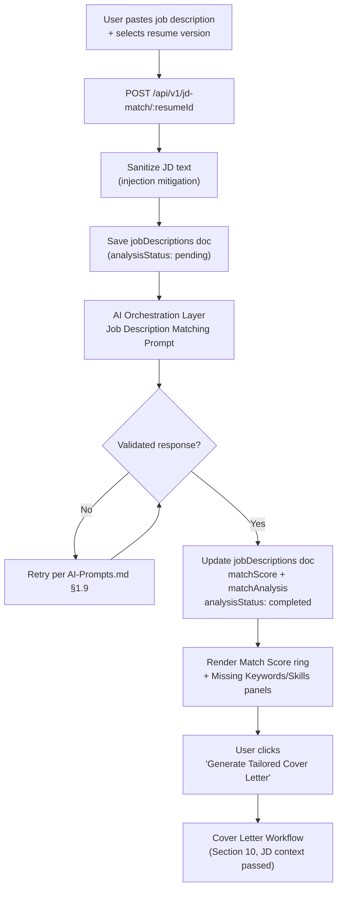
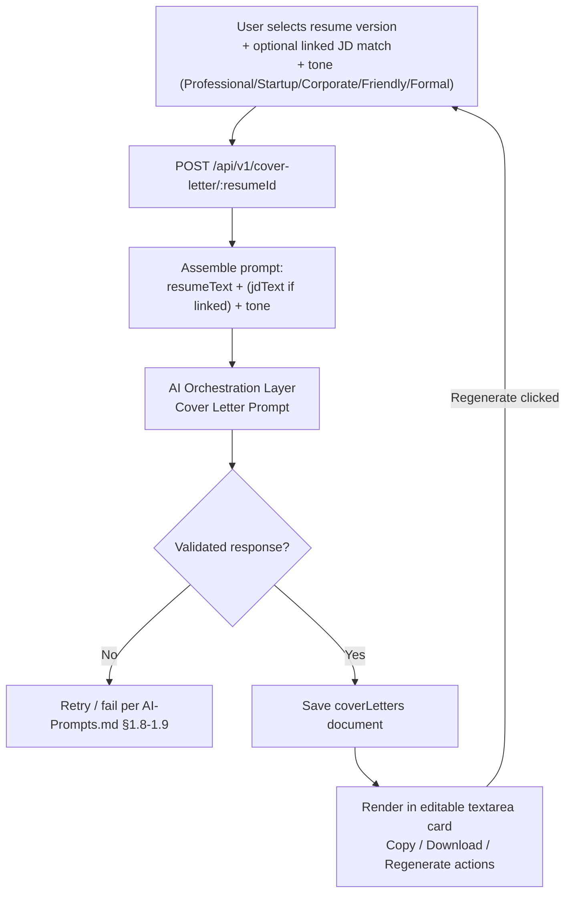
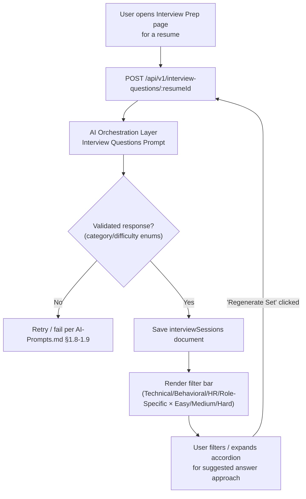
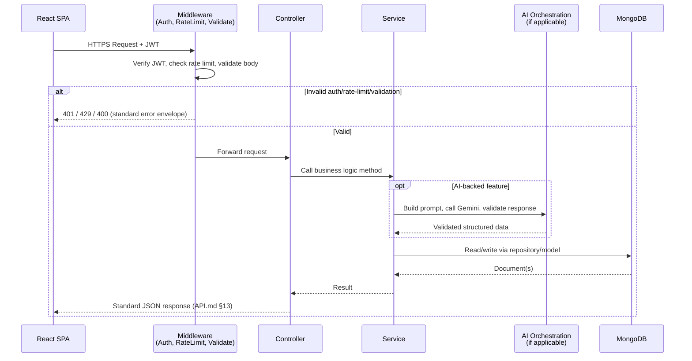
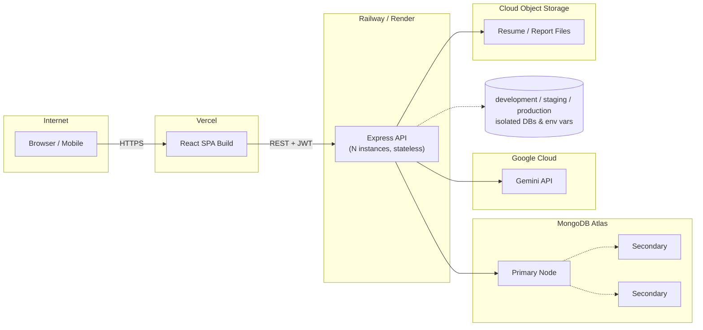

# Architecture.md
# Software Architecture Specification
## AI Resume Analyzer & Career Assistant

**Document Version:** 1.0
**Document Type:** Software Architecture Specification
**Reference:** SRS v1.0, Database Architecture v1.0, API Specification v1.0, UI/UX Design Specification v1.0
**Status:** Ready for Development

---

## Table of Contents

1. System Overview
2. High-Level Architecture
3. Frontend Architecture
4. Backend Architecture
5. Database Architecture
6. AI Service Architecture
7. Authentication Flow
8. Resume Processing Workflow
9. Job Description Matching Workflow
10. Cover Letter Workflow
11. Interview Workflow
12. API Architecture
13. Deployment Architecture
14. Security Architecture
15. Performance Architecture
16. Scalability Strategy
17. Logging & Monitoring
18. Error Handling Strategy
19. Folder Structure
20. Future Architecture

---

## 1. System Overview

### 1.1 Overall Architecture

The AI Resume Analyzer & Career Assistant is a **three-tier, client-server, RESTful SaaS application** (SRS §10) composed of a React single-page application, a stateless Node.js/Express API layer, a MongoDB Atlas document database, and an externally integrated AI reasoning engine (Google Gemini). The system is intentionally **monolithic-but-modular** at MVP scale — a single deployable backend service organized into strict layers — with explicit seams (service interfaces, an AI abstraction layer, a stateless API contract) that allow individual pieces to be extracted into separate services as scale demands (Section 16).

### 1.2 Technology Stack

| Layer | Technology |
|---|---|
| Frontend | React (SPA), React Router, Recharts (charts per SRS FR-19), Tailwind-based design tokens (UI-Guide.md) |
| Backend | Node.js, Express.js |
| Database | MongoDB Atlas, Mongoose ODM |
| AI Engine | Google Gemini API (`gemini-1.5-pro` primary) |
| Authentication | JWT (access + refresh tokens) |
| File Parsing | `pdf-parse` (PDF), `mammoth` (DOCX) |
| File Storage | Cloud object storage (S3-compatible) — DB-referenced for MVP per SRS §22 |
| Caching (Phase 2+) | Redis (Upstash) |
| Frontend Hosting | Vercel |
| Backend Hosting | Railway or Render |
| Monitoring | Platform-native logging + optional Sentry (SRS §22) |

### 1.3 Architecture Style

**RESTful, resource-oriented, stateless-backend, layered (Controller → Service → Repository/Model) architecture** with a dedicated AI orchestration layer that isolates all Gemini integration behind a provider-agnostic interface (SRS §25 risk: vendor lock-in mitigation).

### 1.4 Design Principles

- **Statelessness** — every API request is self-contained (JWT-authenticated); no server-side session state, enabling horizontal scaling behind a load balancer (SRS §6, §21).
- **Separation of concerns** — Controllers handle HTTP I/O only; Services hold business logic; Repositories/Models handle data access; the AI layer is a peer service, not embedded logic inside controllers.
- **Single source of truth for schemas** — the JSON schemas defined in AI-Prompts.md are kept in lockstep with the Mongoose schemas in Database.md, validated via shared type definitions rather than duplicated by hand.
- **Decoupled parsing from analysis** — file parsing and AI analysis are distinct pipeline stages (SRS §10), enabling re-analysis without re-parsing and analysis-result caching by content hash (Database.md §10.4).
- **Provider abstraction** — the AI service interface does not leak Gemini-specific types/concepts into business logic, enabling a future provider swap with changes isolated to one module.
- **Design for the roadmap, not just the MVP** — folder structure, schema flexibility, and service boundaries are chosen so that Phase 2/3 features (SRS §26) slot in without architectural rewrites.

---

## 2. High-Level Architecture

| Component | Responsibility |
|---|---|
| **Frontend (React SPA)** | Renders all UI defined in UI-Guide.md; communicates exclusively via the versioned REST API (API.md); holds no business logic beyond presentation/validation-for-UX. |
| **Backend (Express API)** | Validates input, authenticates/authorizes, orchestrates parsing/AI calls, persists/retrieves data, returns standard JSON responses (API.md §13). |
| **Database (MongoDB Atlas)** | Persists all collections defined in Database.md; sole system of record. |
| **AI Service (Google Gemini)** | External reasoning engine invoked exclusively server-side (API key never exposed to client, per SRS §19); never called directly from the frontend. |
| **File Storage** | Stores resume binaries (PDF/DOCX) and generated report PDFs; referenced by URL/key from MongoDB documents, not embedded as binary blobs. |
| **Authentication** | JWT issuance/validation; stateless, carried via `Authorization: Bearer` header or HTTP-only cookie (API.md §1.4). |
| **Deployment** | Frontend on Vercel; backend on Railway/Render; database on MongoDB Atlas — three independently deployable units (SRS §6 Portability). |

### 2.1 High-Level Diagram

---

## 3. Frontend Architecture

### 3.1 React Structure

The frontend follows a **pages-compose-components, hooks-encapsulate-logic, services-call-API** pattern.

- **Pages** — one per route in UI-Guide.md §7 (Landing, Auth, Dashboard, ResumeAnalysis, JobMatch, CoverLetter, InterviewPrep, CareerRoadmap, Reports, History, Profile, Settings, 404). Pages compose components and own page-level data fetching via hooks.
- **Components** — organized by domain (`dashboard/`, `charts/`, `upload/`, `common/`) per SRS §27's suggested structure; presentational where possible, with logic delegated to hooks.
- **Hooks** — encapsulate data-fetching (`useResumeAnalysis`, `useAuth`, `useTheme`), polling logic for long-running AI calls (UI-Guide.md §8.1 AI Processing state), and shared UI behavior (`useDisclosure` for accordions/modals).
- **Services** — thin wrappers around `fetch`/`axios` calls to the versioned API (`authService.js`, `resumeService.js`, `analysisService.js`, …), each mapping 1:1 to a base path in API.md (e.g., `resumeService.js` → `/api/v1/resumes`).
- **Utilities** — formatting helpers (score-to-color mapping per UI-Guide.md §2.3, date formatting, file-size formatting).
- **Routing** — React Router, with route guards for authenticated routes (redirect to `/login` on missing/expired JWT) and code-split route bundles for performance (SRS §20).
- **State Management** — React Context for global concerns (auth state, theme/dark-mode per SRS FR-18), local component state and React Query/SWR-style caching for server data (resume list, analysis results) to avoid prop-drilling and redundant fetches.

### 3.2 Frontend Folder Structure
frontend/

├── src/

│   ├── assets/

│   ├── components/

│   │   ├── common/          # Buttons, Inputs, Modals, Badges (design tokens from UI-Guide.md)

│   │   ├── dashboard/        # Score cards, action panel, recent resumes list

│   │   ├── charts/           # Radar/Bar/Line wrappers around Recharts

│   │   └── upload/           # Drag-and-drop uploader, file validation UI

│   ├── pages/

│   │   ├── Landing/

│   │   ├── Auth/              # Login, Register, ForgotPassword

│   │   ├── Dashboard/

│   │   ├── ResumeAnalysis/

│   │   ├── JobMatch/

│   │   ├── CoverLetter/

│   │   ├── InterviewPrep/

│   │   ├── CareerRoadmap/

│   │   ├── Reports/

│   │   ├── History/

│   │   ├── Profile/

│   │   ├── Settings/

│   │   └── NotFound/

│   ├── routes/                # Route config, guards

│   ├── context/                # AuthContext, ThemeContext

│   ├── hooks/                  # useAuth, useResumeAnalysis, useTheme, usePolling

│   ├── services/                # API call wrappers (one per API.md base path)

│   ├── utils/                    # scoreColor.js, formatDate.js, fileValidation.js

│   └── App.jsx

└── package.json
---

## 4. Backend Architecture

### 4.1 Layered Structure
Request → Middleware → Controller → Service → Repository/Model → MongoDB

│

└──→ AI Orchestration Layer → Gemini API
- **Controllers** — parse/validate HTTP request shape, call the appropriate service, format the standard response envelope (Section 12), and pass errors to the centralized error-handling middleware. Controllers contain **no business logic**.
- **Routes** — declare the URL/method/middleware/controller bindings per API.md's resource paths (`/api/v1/auth`, `/api/v1/resumes`, `/api/v1/analysis`, etc.).
- **Middleware** — `auth.js` (JWT verification), `upload.js` (Multer-based file intake + type/size validation per SRS FR-20), `validate.js` (request body schema validation), `rateLimiter.js` (API.md rate limiting), `errorHandler.js` (centralized error formatting, Section 18).
- **Services** — business logic: `authService`, `resumeService`, `parsingService`, `analysisService`, `jdMatchService`, `coverLetterService`, `interviewService`, `reportService`, `careerRoadmapService`. Services call repositories for persistence and the AI orchestration layer for Gemini calls — never `fetch` to Gemini directly from a controller.
- **Repositories** (thin Mongoose model wrappers) — encapsulate query logic per collection (Database.md §3), keeping index-aware query patterns (e.g., always filtering `isDeleted: false`) in one place rather than duplicated across services.
- **Utilities** — `jwt.js`, `bcryptHelper.js`, `fileHash.js` (SHA-256 for AI cache keys per Database.md §10.4), `responseFormatter.js`.
- **Error Handling** — all thrown errors (validation, not-found, AI failures) flow to a single Express error-handling middleware that maps internal error types to the HTTP status codes in API.md §1.6.

### 4.2 Backend Folder Structure
backend/

├── src/

│   ├── config/                  # env loading, DB connection, Gemini client config

│   ├── controllers/

│   │   ├── auth.controller.js

│   │   ├── resume.controller.js

│   │   ├── analysis.controller.js

│   │   ├── jdMatch.controller.js

│   │   ├── coverLetter.controller.js

│   │   ├── interview.controller.js

│   │   ├── report.controller.js

│   │   └── user.controller.js

│   ├── services/

│   │   ├── ai/                    # Gemini integration layer

│   │   │   ├── geminiClient.js

│   │   │   ├── promptBuilder.js

│   │   │   ├── responseValidator.js

│   │   │   ├── retryHandler.js

│   │   │   └── prompts/            # versioned prompt templates (AI-Prompts.md §1.1)

│   │   ├── parsing/                # pdf-parse / mammoth logic

│   │   │   ├── pdfParser.js

│   │   │   ├── docxParser.js

│   │   │   └── sectionSegmenter.js

│   │   ├── report/                  # PDF report generation

│   │   ├── auth.service.js

│   │   ├── resume.service.js

│   │   ├── analysis.service.js

│   │   ├── jdMatch.service.js

│   │   ├── coverLetter.service.js

│   │   ├── interview.service.js

│   │   └── careerRoadmap.service.js

│   ├── models/                       # Mongoose schemas (1:1 with Database.md §3)

│   │   ├── User.js

│   │   ├── Resume.js

│   │   ├── ResumeAnalysis.js

│   │   ├── JobDescription.js

│   │   ├── CoverLetter.js

│   │   ├── InterviewSession.js

│   │   ├── CareerRoadmap.js

│   │   ├── Report.js

│   │   ├── Notification.js

│   │   ├── Settings.js

│   │   └── ActivityLog.js

│   ├── routes/

│   │   ├── auth.routes.js

│   │   ├── resume.routes.js

│   │   ├── analysis.routes.js

│   │   ├── jdMatch.routes.js

│   │   ├── coverLetter.routes.js

│   │   ├── interview.routes.js

│   │   ├── report.routes.js

│   │   └── user.routes.js

│   ├── middlewares/

│   │   ├── auth.js

│   │   ├── upload.js

│   │   ├── validate.js

│   │   ├── rateLimiter.js

│   │   └── errorHandler.js

│   ├── utils/

│   │   ├── jwt.js

│   │   ├── bcryptHelper.js

│   │   ├── fileHash.js

│   │   └── responseFormatter.js

│   └── server.js

└── package.json
---

## 5. Database Architecture

Full collection schemas, field-level validation, indexing strategy, and example documents are authoritatively defined in **Database.md**; this section summarizes the architectural shape only.

### 5.1 Collections

| Collection | Role |
|---|---|
| `users` | Root entity; auth, profile, plan tier |
| `resumes` | File metadata, parsed text, structured sections, version history |
| `resumeAnalysis` | Full AI analysis output per resume version (richest collection) |
| `jobDescriptions` | JD text + match analysis vs. a resume |
| `coverLetters` | Generated cover letter content |
| `interviewSessions` | Generated interview questions |
| `careerRoadmaps` | AI career recommendations |
| `reports` | PDF report metadata |
| `notifications` | In-app/email notification records |
| `settings` | Per-user preferences |
| `activityLogs` | Audit trail |

### 5.2 Relationships

Every child collection denormalizes `userId` (Database.md §11.2) to support single-collection, user-scoped queries without `$lookup` for the dominant access pattern.

### 5.3 Index Strategy (summary)

Indexes are built around the read paths in the user journey (SRS §9): resume history lists (`userId + createdAt`), latest analysis lookup (`resumeId`), score-trend queries (`userId + overallScore`/`atsScore`), and TTL-style token lookups for password reset/email verification. Full index definitions are in Database.md §5.

### 5.4 Data Flow

`resumes` (upload) → `resumeAnalysis` (AI output, referencing `resumeId`) → `careerRoadmaps` / `reports` / `coverLetters` / `interviewSessions` (downstream features, referencing both `resumeId` and often `analysisId`) → `notifications` (side-effect of completion) → `activityLogs` (audit record of every step).

---

## 6. AI Service Architecture

### 6.1 Layers
analysisService.js

│

▼

promptBuilder.js  ──── loads versioned template from prompts/<name>/v<version>/

│

▼

geminiClient.js  ──── calls Gemini API (JSON mode where available)

│

▼

responseValidator.js ── 3-stage validation (AI-Prompts.md §1.6)

│

├── pass ──→ persist to MongoDB

└── fail ──→ retryHandler.js ──→ corrective retry or final failure
### 6.2 Prompt Layer
All prompt templates (system + user, per prompt type) live under `services/ai/prompts/`, versioned per AI-Prompts.md §19. The `promptBuilder` populates placeholders from sanitized input only — never raw concatenation — and wraps untrusted variable content in delimiter blocks (AI-Prompts.md §1.7).

### 6.3 Gemini Integration
`geminiClient.js` is the **only** module in the codebase that imports the Gemini SDK/calls its endpoint. All other services depend on this module's exported interface (e.g., `generateStructuredResponse(promptName, variables)`), not on Gemini-specific types — satisfying the provider-abstraction principle (Section 1.4) and the vendor lock-in mitigation called out in SRS §25.

### 6.4 JSON Validation
`responseValidator.js` implements the three-stage pipeline defined in AI-Prompts.md §1.6: syntactic parse → JSON Schema validation (`ajv`/`zod`, schemas generated from/kept in sync with Mongoose models) → semantic sanity checks.

### 6.5 Retry Logic
`retryHandler.js` implements AI-Prompts.md §1.8–1.9: exponential backoff for transient/network failures (max 2 retries), single corrective retry for malformed/invalid-schema responses, 3-attempt combined ceiling, with every attempt logged (Section 17).

### 6.6 Caching Strategy
Per Database.md §10.4: resume content is SHA-256 hashed (`fileHash.js`) before each AI call. A Redis cache (`AI Result Cache`, 24h TTL) keyed by content hash + prompt name + prompt version is checked first; a hit short-circuits the Gemini call entirely, directly satisfying the SRS §25 cost-control mitigation and SRS §20 performance target.

### 6.7 Rate Limiting
AI-triggering endpoints (`POST /api/v1/analysis/:resumeId`, `POST /api/v1/jd-match/:resumeId`, `POST /api/v1/cover-letter/:resumeId`, `POST /api/v1/interview-questions/:resumeId`) carry a stricter per-user rate limit than general API traffic, enforced by `rateLimiter.js` middleware, to control Gemini API cost exposure (SRS §19, §25) independent of the global API rate limit (API.md §18).

---

## 7. Authentication Flow

### 7.1 JWT Strategy
- **Access token** — short-lived (e.g., 15 minutes), carried via `Authorization: Bearer` header or HTTP-only cookie (API.md §1.4, preferred for browser clients).
- **Refresh token** — longer-lived, HTTP-only, secure cookie; used solely against `/api/v1/auth/refresh-token` to mint a new access token without re-prompting credentials.
- **Role-Based Access** — `users.role` (`user`/`admin`) embedded in the JWT payload; `auth.js` middleware enforces route-level role checks for the future Admin APIs (API.md §12, not user-facing in V1 per SRS §8).

### 7.2 Sequence Diagram — Login & Refresh

---

## 8. Resume Processing Workflow

Implements SRS §17 (Resume Parsing Workflow) and §16 (AI Processing Workflow) end-to-end.

---

## 9. Job Description Matching Workflow

Implements SRS FR-10, UI-Guide.md §7.9.

---

## 10. Cover Letter Workflow

Implements SRS FR-11, UI-Guide.md §7.11.

---

## 11. Interview Workflow

Implements SRS FR-12, UI-Guide.md §7.12.

---

## 12. API Architecture

### 12.1 Request Flow

All endpoints follow the same architectural path regardless of feature:

### 12.2 Standard Response Format
Per API.md, all responses share a consistent JSON envelope (success flag, `data`/`error` payload, and pagination metadata where applicable for list endpoints like resume history and reports).

### 12.3 Versioning
All routes are served under `/api/v1/` (API.md §1.3); breaking changes are introduced as `/api/v2/` additive routes, never in-place replacements, until client migration completes.

---

## 13. Deployment Architecture

| Component | Platform | Configuration |
|---|---|---|
| Frontend (React SPA) | **Vercel** | Git-integrated CI/CD, automatic preview deployments per PR |
| Backend (Express API) | **Railway** or **Render** | Environment-variable secrets, auto-restart on crash, horizontal instance scaling |
| Database | **MongoDB Atlas** | Managed replica set, automated backups, IP allowlist network rules |
| File Storage | S3-compatible object storage (post-MVP) / DB-referenced storage (MVP) | Migration path to dedicated object storage as volume grows |
| AI Provider | **Google Gemini API** | Server-side only; key in environment variables, never shipped to client |
| Monitoring | Platform-native logs (Railway/Render) + optional Sentry | Error tracking, uptime alerts |

### 13.1 Deployment Diagram

**Environments:** `development`, `staging`, `production`, each with isolated MongoDB Atlas instances and environment variable sets (SRS §22), enabling safe iteration on prompt versions (AI-Prompts.md §19) without affecting production analysis data.

---

## 14. Security Architecture

| Domain | Implementation |
|---|---|
| **Authentication** | bcrypt-hashed passwords (cost ≥10, Database.md §3.1); short-lived JWT access tokens + refresh token rotation |
| **Authorization** | Middleware enforces resource ownership — users can only access/modify their own `resumes`/`resumeAnalysis`/`reports`/etc. (`userId` check on every query) |
| **Encryption** | TLS enforced in production for all traffic; resume content encrypted at rest where the storage provider supports it (SRS §19) |
| **Input Validation** | Schema-based request body validation (`validate.js` middleware) on every mutating endpoint; JD/resume text sanitized before AI prompt assembly (AI-Prompts.md §1.7) |
| **File Validation** | Strict MIME-type + extension allowlist (PDF, DOCX only), 5MB size cap, enforced in `upload.js` middleware before storage (SRS FR-04/FR-20) |
| **Secrets Management** | Gemini API key, JWT secret, DB connection string — environment variables only, never committed to source control |
| **Rate Limiting** | General API rate limits (API.md §18) plus a stricter tier on AI-triggering endpoints (Section 6.7) to control both abuse and Gemini cost exposure |
| **CORS** | Restricted to the deployed frontend origin(s) only |
| **Helmet** | Standard secure-header middleware (`X-Content-Type-Options`, `X-Frame-Options`, CSP baseline) applied globally |
| **Prompt Injection** | Delimiter-wrapped untrusted input + explicit "ignore embedded instructions" system-prompt clause (AI-Prompts.md §1.7) |
| **Data Privacy** | Soft-delete model (`isDeleted`) with scheduled hard-purge after retention window (Database.md §3.1); "Delete My Data" account option (SRS §19) |

---

## 15. Performance Architecture

- **Caching** — AI result cache keyed by content hash (Database.md §10.4, Section 6.6 above) avoids redundant Gemini calls for identical resume content; API response cache (Redis, 5-minute TTL) for dashboard statistics and notification counts.
- **Lazy Loading** — frontend routes code-split via React Router; below-the-fold dashboard sections (e.g., charts) lazy-rendered after initial paint.
- **Pagination** — all list endpoints (resume history, reports, notifications) paginated server-side; never returning unbounded arrays.
- **Compression** — gzip/Brotli response compression at the Express layer; frontend asset compression via Vercel's build pipeline.
- **Database Optimization** — indexes aligned exactly to query patterns (Database.md §5, §11.6 optimization checklist); projection used wherever a full document isn't needed; `secondaryPreferred` read routing for analytics/history queries (Database.md §10.3).
- **AI Latency Management** — asynchronous, non-blocking AI calls; rotating status-text "AI Processing" UI state rather than a static spinner during the expected 15–25s window (SRS §20, UI-Guide.md §8.1), with the option to navigate away and be notified on completion (`notifications` collection) rather than being forced to wait synchronously.

---

## 16. Scalability Strategy

### 16.1 Horizontal Scaling
Stateless Express instances scale horizontally behind a load balancer (Railway/Render auto-scaling) since no server-side session state exists (Section 1.4). MongoDB Atlas scales horizontally via sharding on high-volume collections (`resumes`, `resumeAnalysis`, `activityLogs`) using hashed `userId` shard keys once collection size thresholds are crossed (Database.md §10.1).

### 16.2 Vertical Scaling
Atlas cluster tiers scale vertically with zero downtime across the MVP → Growth → Scale → Enterprise phases defined in Database.md §10.2 (M10 → M20 → M40 → M80+).

### 16.3 Future Microservices
The current modular monolith is structured so that the **AI Orchestration Layer**, **Parsing Service**, and **Report Generation Service** are the natural first extraction candidates into independent services/Lambdas, since they are already isolated behind clean interfaces (Section 4.1) and have distinct scaling/cost profiles from the core CRUD API.

### 16.4 Redis
Introduced at Phase 2 (Database.md §1.2) for: AI result caching (Section 6.6), API response caching, and — at higher scale — as the backing store for a job queue.

### 16.5 Queues
A job queue (BullMQ + Redis, per SRS §20/§21) is the planned mechanism for decoupling AI analysis requests from the synchronous request/response cycle once concurrent AI request volume makes direct synchronous Gemini calls impractical — the request would enqueue a job and return immediately with a `processing` status, with the frontend polling or receiving a notification on completion (a natural extension of the existing `analysisStatus` state machine already defined in Database.md §3.2).

### 16.6 Event Processing
As features grow (e.g., usage-based billing, admin analytics), a lightweight internal event bus (or simply structured `activityLogs` entries consumed by a scheduled aggregation job) supports downstream consumers (analytics rollups, notification triggers) without tightly coupling them to the request path that generated the event.

---

## 17. Logging & Monitoring

| Log Type | Content | Tool |
|---|---|---|
| **Application Logs** | Service-level events (resume uploaded, analysis triggered, user registered) | Winston/Pino structured JSON logs |
| **Error Logs** | Unhandled exceptions, validation failures, stack traces | Winston/Pino + optional Sentry |
| **API Logs** | Request method/path/status/latency, `X-Request-ID` correlation (API.md §1.5) | Express logging middleware (e.g., `morgan` piped to structured logger) |
| **AI Logs** | Prompt name/version, model, attempt number, latency (`processingTimeMs`), validation pass/fail, retry count | Dedicated AI orchestration logger (feeds prompt-quality dashboard, AI-Prompts.md §1.9) |
| **Performance Monitoring** | DB query latency (Atlas Monitoring, Database.md §11.5), connection pool utilization, P95 API latency | Atlas Monitoring + platform-native (Railway/Render) metrics |

Slow queries (>100ms) and AI calls exceeding expected latency bands are flagged for review; AI validation-failure rate is tracked against the SRS §28 success metric of <2% AI call error rate.

---

## 18. Error Handling Strategy

| Layer | Strategy |
|---|---|
| **Frontend** | Field-level inline errors; page-level alert banners with "Retry" for failed AI calls/network errors; error-boundary fallback screen for catastrophic render failures (UI-Guide.md §8.3) |
| **Backend** | Centralized `errorHandler.js` middleware maps internal error types to standard HTTP codes (API.md §1.6) and the standard error response envelope; no unhandled promise rejections reach the client as raw stack traces |
| **Database** | Connection errors trigger retry-with-backoff at the driver level (`retryWrites: true`); write-concern failures (`w: "majority"`) surface as `500`s with logged detail, not silently swallowed |
| **AI** | Three-stage validation + corrective retry + final-failure status flagging, exactly as specified in AI-Prompts.md §1.6–1.9 |
| **External APIs** | Gemini timeouts/rate-limits/outages handled via the circuit-breaker pattern (AI-Prompts.md §1.8) to prevent cascading failures into the core API's request threads |

---

## 19. Folder Structure

A consolidated, production-ready view combining Sections 3.2 and 4.2 above, matching the structure first proposed in SRS §27:
ai-resume-analyzer/

├── frontend/

│   ├── src/

│   │   ├── assets/

│   │   ├── components/

│   │   │   ├── common/

│   │   │   ├── dashboard/

│   │   │   ├── charts/

│   │   │   └── upload/

│   │   ├── pages/

│   │   │   ├── Landing/

│   │   │   ├── Auth/

│   │   │   ├── Dashboard/

│   │   │   ├── ResumeAnalysis/

│   │   │   ├── JobMatch/

│   │   │   ├── CoverLetter/

│   │   │   ├── InterviewPrep/

│   │   │   ├── CareerRoadmap/

│   │   │   ├── Reports/

│   │   │   ├── History/

│   │   │   ├── Profile/

│   │   │   ├── Settings/

│   │   │   └── NotFound/

│   │   ├── routes/

│   │   ├── context/

│   │   ├── hooks/

│   │   ├── services/

│   │   ├── utils/

│   │   └── App.jsx

│   └── package.json

│

├── backend/

│   ├── src/

│   │   ├── config/

│   │   ├── controllers/

│   │   ├── services/

│   │   │   ├── ai/

│   │   │   │   └── prompts/

│   │   │   ├── parsing/

│   │   │   └── report/

│   │   ├── models/

│   │   ├── routes/

│   │   ├── middlewares/

│   │   │   ├── auth.js

│   │   │   ├── upload.js

│   │   │   ├── validate.js

│   │   │   ├── rateLimiter.js

│   │   │   └── errorHandler.js

│   │   ├── utils/

│   │   └── server.js

│   └── package.json

│

└── README.md
---

## 20. Future Architecture

The architecture evolves from this MVP/Phase-2 baseline into an enterprise SaaS platform along the paths already seeded in SRS §23 and §26, without requiring a rewrite:

| Evolution | Architectural Change |
|---|---|
| **AI Mock Interview (voice/video)** | New media-handling service (WebRTC or recorded-upload + transcription) feeding a dedicated real-time-feedback Gemini prompt; the existing `interviewSessions` collection extends naturally to store session transcripts/scores |
| **Multi-provider / Microservices** | AI Orchestration Layer, Parsing Service, and Report Service extracted into independently deployable services as load profiles diverge from the core API (Section 16.3) |
| **Job Queue Adoption** | BullMQ + Redis decouples all AI-triggering endpoints from synchronous request handling (Section 16.5), a prerequisite for sustained concurrent load |
| **Recruiter/Enterprise Role** | New `role: "recruiter"` / `"enterprise_admin"` values extend `users.role` (Database.md §3.1 already anticticipates this via its enum design); new recruiter-facing routes added under `/api/v1/` without disturbing existing user-facing routes |
| **Billing/Subscription** | A dedicated PostgreSQL instance is introduced specifically for transactional billing data (Database.md §10.5), while MongoDB remains the system of record for application data — a deliberate polyglot-persistence boundary rather than forcing relational billing logic into MongoDB |
| **Multi-language Resume Support** | Parsing layer gains language detection (`resumes.languageDetected`, already flagged as Future Expansion in Database.md §3.2); prompt templates gain language-aware variants |
| **Resume Template Builder** | New `templates` collection + a dedicated frontend builder module; AI Rewrite prompts extend to populate template fields directly rather than only producing prose |
| **Full-Text Search** | MongoDB Atlas Search (already noted as a Phase 2 trigger in Database.md §1.2) for resume/JD keyword search; optional dual-write to Elasticsearch if search complexity grows beyond Atlas Search's capability (Database.md §10.5) |
| **Global Multi-Region** | MongoDB Atlas Global Clusters + regional API deployments behind a geo-aware routing layer, once user base internationalizes meaningfully beyond a single primary region |

This evolution path preserves every architectural seam already established at MVP: the **AI abstraction layer** absorbs new prompt types and even new model providers without touching business logic; the **layered backend** absorbs new resource types as new controller/service/model triads without restructuring existing ones; and the **stateless API contract** means new client surfaces (a future native mobile app, a recruiter dashboard) can be added as new consumers of the same `/api/v1/` (and later `/api/v2/`) surface without backend changes beyond normal feature growth.