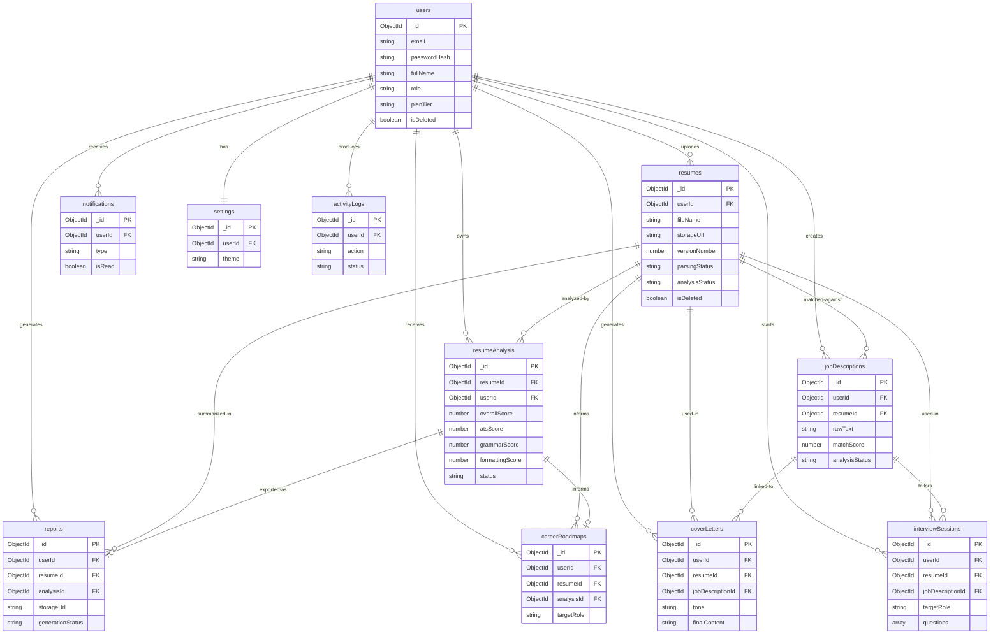

# Database.md
# Database Architecture Specification
## AI Resume Analyzer & Career Assistant

**Document Version:** 1.0
**Document Type:** Database Architecture Specification
**Reference:** SRS v1.0, UI/UX Design Specification v1.0
**Status:** Ready for Development

---

## Table of Contents

1. Database Overview
2. Collections Overview
3. Complete Collection Design
4. Relationships
5. Index Strategy
6. Data Validation Strategy
7. File Storage Strategy
8. Security Strategy
9. Backup Strategy
10. Scaling Strategy
11. Database Best Practices

---

## 1. Database Overview

### 1.1 Why MongoDB

MongoDB was selected as the primary database for the AI Resume Analyzer & Career Assistant based on a careful evaluation of the application's data characteristics, access patterns, and long-term scalability requirements.

| Decision Factor | Justification |
|---|---|
| Schema Flexibility | Resume data, AI analysis results, and career roadmap outputs are deeply nested, variable-length JSON structures. MongoDB's document model stores these naturally without impedance mismatch. |
| AI Output Storage | Gemini AI returns structured JSON objects with variable fields across analysis types. Storing these as embedded documents eliminates complex relational joins. |
| Rapid Iteration | SaaS products evolve quickly. MongoDB allows fields to be added to documents without costly schema migrations, supporting the MVP-to-Premium roadmap defined in the SRS. |
| Developer Velocity | The Node.js/Express.js backend integrates natively with MongoDB via Mongoose ODM, sharing the same JavaScript/JSON data model end-to-end. |
| Atlas Managed Service | MongoDB Atlas provides automated backups, global cluster distribution, built-in monitoring, and serverless scaling with minimal operational overhead — ideal for the Railway/Render + Atlas deployment model described in SRS Section 22. |
| Rich Query Language | MongoDB's aggregation pipeline supports the analytics dashboard requirements (score trends, user progress charts, resume improvement tracking) without a separate analytics database. |
| Horizontal Scalability | Native sharding support allows the database layer to scale horizontally as user volume grows from MVP to premium subscriber base. |
| GridFS / File Metadata | Resume file metadata and references to cloud-stored files integrate cleanly into the document model alongside analysis results. |

### 1.2 Scalability Design

The database is designed with three phases of scale in mind, matching the SRS development roadmap:

**Phase 1 — MVP (0–5,000 users):**
- Single MongoDB Atlas M10 cluster (dedicated)
- All collections on one replica set
- Indexes cover all primary query paths
- No sharding required

**Phase 2 — Advanced (5,000–50,000 users):**
- Atlas M30 cluster with 3-node replica set
- Read preference directed to secondaries for analytics queries
- Atlas Search enabled for full-text resume/job description search
- Redis caching layer introduced for AI result caching

**Phase 3 — Premium (50,000+ users):**
- Horizontal sharding on high-volume collections (`resumes`, `resumeAnalysis`, `activityLogs`)
- Shard key strategy: `userId` hashed sharding for uniform distribution
- Global clusters considered for multi-region deployments
- Time-series collections for analytics event data

### 1.3 Indexing Philosophy

Indexes are designed around the application's most frequent read paths, identified from the SRS user journeys and feature requirements:

- Every foreign key reference field carries an index to support relational lookups.
- Compound indexes are created for the exact field combinations used in dashboard queries.
- TTL indexes automatically expire temporary data (password reset tokens, email verification tokens) without cron jobs.
- Text indexes support resume content search and job description keyword matching.
- All indexes are created with `background: true` in production to avoid blocking operations.

---

## 2. Collections Overview

| Collection Name | Purpose | Key Relationships | Estimated Size (per 10k users) | Primary Indexes |
|---|---|---|---|---|
| `users` | Stores authenticated user accounts, profile data, and account metadata | Parent to all user-owned data | ~10,000 docs / ~50 MB | `email` (unique), `_id` |
| `resumes` | Stores resume file metadata, parsed text content, and section structure | Belongs to `users`; parent to `resumeAnalysis`, `reports` | ~30,000 docs / ~300 MB | `userId`, `createdAt` |
| `resumeAnalysis` | Stores full AI analysis output per resume version | Belongs to `resumes` and `users` | ~30,000 docs / ~600 MB | `resumeId`, `userId`, `createdAt` |
| `jobDescriptions` | Stores job description text and match analysis results | Belongs to `users`; references `resumes` | ~20,000 docs / ~100 MB | `userId`, `resumeId` |
| `coverLetters` | Stores generated cover letter content and metadata | Belongs to `users`; references `resumes` and `jobDescriptions` | ~15,000 docs / ~75 MB | `userId`, `resumeId` |
| `interviewSessions` | Stores generated interview questions and user answer sessions | Belongs to `users`; references `resumes` | ~20,000 docs / ~150 MB | `userId`, `resumeId` |
| `careerRoadmaps` | Stores AI-generated career recommendations and roadmap data | Belongs to `users`; references `resumeAnalysis` | ~10,000 docs / ~80 MB | `userId`, `analysisId` |
| `reports` | Stores metadata for generated PDF reports | Belongs to `users`; references `resumes` and `resumeAnalysis` | ~20,000 docs / ~30 MB | `userId`, `resumeId` |
| `notifications` | Stores in-app and email notification records | Belongs to `users` | ~100,000 docs / ~50 MB | `userId`, `isRead`, `createdAt` |
| `settings` | Stores per-user application preferences | Belongs to `users` (one-to-one) | ~10,000 docs / ~10 MB | `userId` (unique) |
| `activityLogs` | Stores audit trail of significant user and system actions | Belongs to `users` | ~500,000 docs / ~200 MB | `userId`, `action`, `createdAt` |

---

## 3. Complete Collection Design

---

### 3.1 Collection: `users`

**Purpose:**
The `users` collection is the root entity of the entire system. It stores authentication credentials, profile information, account metadata, role assignments, and references to the user's plan tier. Every other collection references `users._id` as its ownership anchor.

**Schema Fields:**

| Field | Type | Required | Description | Validation |
|---|---|---|---|---|
| `_id` | ObjectId | Yes (auto) | MongoDB document identifier | Auto-generated |
| `email` | String | Yes | User's email address — primary login identifier | Lowercase, trimmed, valid email format, unique |
| `passwordHash` | String | Yes | bcrypt-hashed password | Min 60 chars (bcrypt output), never returned in API responses |
| `fullName` | String | Yes | User's full name | Min 2 chars, max 100 chars, trimmed |
| `avatarUrl` | String | No | URL to profile avatar image in cloud storage | Valid URL format |
| `role` | String | Yes | User role in the system | Enum: `["user", "admin"]`, default `"user"` |
| `isEmailVerified` | Boolean | Yes | Whether the user has verified their email address | Default `false` |
| `emailVerificationToken` | String | No | Token for email verification flow | Hashed, nulled after verification |
| `emailVerificationExpires` | Date | No | Expiry timestamp for email verification token | Future date |
| `passwordResetToken` | String | No | Token for forgot-password flow | Hashed, nulled after use |
| `passwordResetExpires` | Date | No | Expiry timestamp for password reset token | Future date |
| `lastLoginAt` | Date | No | Timestamp of most recent successful login | — |
| `loginCount` | Number | Yes | Total number of successful logins | Default `0`, min `0` |
| `planTier` | String | Yes | User's subscription plan | Enum: `["free", "pro", "premium"]`, default `"free"` |
| `planExpiresAt` | Date | No | Expiry date of current paid plan | Null for free tier |
| `resumeCount` | Number | Yes | Cached count of total resumes uploaded | Default `0`, updated on resume create/delete |
| `isActive` | Boolean | Yes | Soft delete flag — false = account deactivated | Default `true` |
| `isDeleted` | Boolean | Yes | Hard soft-delete flag for GDPR compliance | Default `false` |
| `deletedAt` | Date | No | Timestamp when account was deleted | Set on deletion |
| `createdAt` | Date | Yes (auto) | Document creation timestamp | Auto-managed by Mongoose timestamps |
| `updatedAt` | Date | Yes (auto) | Document last-update timestamp | Auto-managed by Mongoose timestamps |

**Unique Constraints:**
- `email` — globally unique across all users

**Indexes:**
- `{ email: 1 }` — unique index, primary login lookup
- `{ role: 1 }` — admin queries filtering by role
- `{ isDeleted: 1, isActive: 1 }` — compound, soft-delete filtering
- `{ emailVerificationToken: 1 }` — TTL-style lookup during verification flow
- `{ passwordResetToken: 1 }` — lookup during password reset flow
- `{ createdAt: -1 }` — admin analytics, user growth charts

**Soft Delete Strategy:**
- `isDeleted: true` is set on account deletion. No documents are physically removed.
- A separate scheduled job (or Atlas trigger) can permanently purge documents where `isDeleted: true` AND `deletedAt` is older than 90 days, in compliance with data retention policies.
- All API queries include `{ isDeleted: false }` as a base filter.

**Audit Fields:** `createdAt`, `updatedAt`, `lastLoginAt`, `loginCount`, `deletedAt`

**Future Expansion:**
- `oauthProviders[]` — array of linked OAuth providers (Google, LinkedIn) for SSO
- `usageQuota{}` — object tracking monthly AI call consumption per plan tier
- `referralCode` — for referral/affiliate program

**Example Document:**
```json
{
  "_id": "64f1a2b3c4d5e6f7a8b9c0d1",
  "email": "riya.sharma@example.com",
  "passwordHash": "$2b$12$examplehashedpasswordstring...",
  "fullName": "Riya Sharma",
  "avatarUrl": "https://storage.example.com/avatars/64f1a2b3.jpg",
  "role": "user",
  "isEmailVerified": true,
  "emailVerificationToken": null,
  "emailVerificationExpires": null,
  "passwordResetToken": null,
  "passwordResetExpires": null,
  "lastLoginAt": "2024-09-15T10:30:00.000Z",
  "loginCount": 12,
  "planTier": "free",
  "planExpiresAt": null,
  "resumeCount": 3,
  "isActive": true,
  "isDeleted": false,
  "deletedAt": null,
  "createdAt": "2024-08-01T08:00:00.000Z",
  "updatedAt": "2024-09-15T10:30:00.000Z"
}
```

---

### 3.2 Collection: `resumes`

**Purpose:**
The `resumes` collection stores all resume-related data: file metadata (name, size, type, storage URL), the raw parsed text extracted from the PDF/DOCX, and the structured section breakdown produced by the parsing layer. Each document represents one version of a resume uploaded by a user. Multiple documents per user form the resume version history.

**Schema Fields:**

| Field | Type | Required | Description | Validation |
|---|---|---|---|---|
| `_id` | ObjectId | Yes (auto) | Document identifier | Auto-generated |
| `userId` | ObjectId | Yes | Reference to owning `users._id` | Must exist in `users` collection |
| `fileName` | String | Yes | Original uploaded file name | Max 255 chars, trimmed |
| `fileSize` | Number | Yes | File size in bytes | Min 1, max 5242880 (5MB) |
| `fileType` | String | Yes | MIME type of uploaded file | Enum: `["application/pdf", "application/vnd.openxmlformats-officedocument.wordprocessingml.document"]` |
| `storageUrl` | String | Yes | Full URL to file in cloud storage | Valid URL |
| `storageKey` | String | Yes | Cloud storage object key/path | Unique per file |
| `versionNumber` | Number | Yes | Sequential version number per user | Min 1, auto-incremented |
| `versionLabel` | String | No | User-defined label for this version | Max 50 chars |
| `parsedText` | String | Yes | Full raw text extracted from the resume file | Min 50 chars (reject empty/unreadable files) |
| `sections` | Object | Yes | Structured section breakdown of the resume | See nested schema below |
| `sections.contactInfo` | Object | No | Extracted contact information | — |
| `sections.summary` | String | No | Professional summary / objective section text | — |
| `sections.experience` | Array | No | Array of work experience entry objects | — |
| `sections.education` | Array | No | Array of education entry objects | — |
| `sections.skills` | Array | No | Array of extracted skill strings | — |
| `sections.projects` | Array | No | Array of project entry objects | — |
| `sections.certifications` | Array | No | Array of certification strings | — |
| `sections.achievements` | Array | No | Array of achievement strings | — |
| `wordCount` | Number | Yes | Total word count of parsed resume text | Min 0 |
| `pageCount` | Number | No | Estimated page count of the resume | Min 1, max 10 |
| `parsingStatus` | String | Yes | Status of the parsing operation | Enum: `["pending", "success", "failed"]`, default `"pending"` |
| `parsingError` | String | No | Error message if parsing failed | — |
| `analysisStatus` | String | Yes | Status of the AI analysis | Enum: `["pending", "processing", "completed", "failed"]`, default `"pending"` |
| `isDeleted` | Boolean | Yes | Soft delete flag | Default `false` |
| `deletedAt` | Date | No | Timestamp of soft deletion | — |
| `createdAt` | Date | Yes (auto) | Upload timestamp | — |
| `updatedAt` | Date | Yes (auto) | Last update timestamp | — |

**Indexes:**
- `{ userId: 1, createdAt: -1 }` — compound, primary query for resume history list
- `{ userId: 1, versionNumber: -1 }` — latest version lookup
- `{ userId: 1, isDeleted: 1 }` — soft-delete filtered queries
- `{ storageKey: 1 }` — unique, storage deduplication
- `{ parsingStatus: 1 }` — background job polling for pending parses
- `{ analysisStatus: 1 }` — background job polling for pending analyses

**Relationships:**
- `userId` → `users._id` (many-to-one)
- Referenced by `resumeAnalysis.resumeId`
- Referenced by `reports.resumeId`
- Referenced by `coverLetters.resumeId`
- Referenced by `interviewSessions.resumeId`
- Referenced by `jobDescriptions.resumeId`

**Future Expansion:**
- `ocrText` — OCR-extracted text for scanned PDF support
- `languageDetected` — detected language of resume content
- `templateId` — reference to a resume template if builder feature is added

**Example Document:**
```json
{
  "_id": "64f2b3c4d5e6f7a8b9c0d2e3",
  "userId": "64f1a2b3c4d5e6f7a8b9c0d1",
  "fileName": "Riya_Sharma_Resume_v3.pdf",
  "fileSize": 187432,
  "fileType": "application/pdf",
  "storageUrl": "https://storage.example.com/resumes/64f1a2b3/v3_resume.pdf",
  "storageKey": "resumes/64f1a2b3/v3_resume.pdf",
  "versionNumber": 3,
  "versionLabel": "Updated with internship",
  "parsedText": "Riya Sharma | riya@example.com | LinkedIn...\nSUMMARY\nFinal year CS student...",
  "sections": {
    "contactInfo": {
      "name": "Riya Sharma",
      "email": "riya@example.com",
      "phone": "+91-9876543210",
      "linkedin": "linkedin.com/in/riyasharma",
      "location": "Mumbai, India"
    },
    "summary": "Final year Computer Science student with strong fundamentals in data structures...",
    "experience": [
      {
        "company": "TechCorp Internship",
        "title": "Software Engineering Intern",
        "duration": "Jun 2024 – Aug 2024",
        "bullets": ["Built REST APIs using Node.js", "Reduced query time by 30%"]
      }
    ],
    "education": [
      {
        "institution": "Mumbai University",
        "degree": "B.E. Computer Engineering",
        "year": "2021–2025",
        "cgpa": "8.7"
      }
    ],
    "skills": ["JavaScript", "React", "Node.js", "MongoDB", "Python", "Git"],
    "projects": [
      {
        "name": "E-Commerce Platform",
        "description": "Built a full-stack e-commerce app with React and Node.js",
        "techStack": ["React", "Node.js", "MongoDB"]
      }
    ],
    "certifications": ["AWS Cloud Practitioner", "Meta Front-End Developer Certificate"],
    "achievements": ["Winner, National Hackathon 2024", "99th percentile in JEE Mains"]
  },
  "wordCount": 412,
  "pageCount": 1,
  "parsingStatus": "success",
  "parsingError": null,
  "analysisStatus": "completed",
  "isDeleted": false,
  "deletedAt": null,
  "createdAt": "2024-09-10T09:15:00.000Z",
  "updatedAt": "2024-09-10T09:16:45.000Z"
}
```

---

### 3.3 Collection: `resumeAnalysis`

**Purpose:**
The `resumeAnalysis` collection stores the complete, structured AI analysis output for each resume. This is the most data-rich collection in the system. Each document corresponds to one AI analysis run on one resume version and contains all scoring dimensions, qualitative feedback, section-by-section review, ATS compatibility data, grammar analysis, formatting review, skills gap, and AI rewrite suggestions — exactly as defined in SRS Section 16.

**Schema Fields:**

| Field | Type | Required | Description |
|---|---|---|---|
| `_id` | ObjectId | Yes | Document identifier |
| `resumeId` | ObjectId | Yes | Reference to `resumes._id` |
| `userId` | ObjectId | Yes | Denormalized reference to `users._id` for faster queries |
| `overallScore` | Number | Yes | Composite overall score (0–100) |
| `atsScore` | Number | Yes | ATS compatibility score (0–100) |
| `grammarScore` | Number | Yes | Grammar and language quality score (0–100) |
| `formattingScore` | Number | Yes | Formatting and structure score (0–100) |
| `skillsScore` | Number | Yes | Skills relevance and completeness score (0–100) |
| `experienceScore` | Number | Yes | Work experience quality score (0–100) |
| `summaryScore` | Number | Yes | Professional summary quality score (0–100) |
| `educationScore` | Number | Yes | Education section quality score (0–100) |
| `projectsScore` | Number | Yes | Projects section quality score (0–100) |
| `scoreSummary` | String | Yes | One-paragraph AI narrative summary of the overall resume quality |
| `strengths` | Array[String] | Yes | List of identified resume strengths |
| `weaknesses` | Array[String] | Yes | List of identified resume weaknesses |
| `quickWins` | Array[String] | Yes | Prioritized list of quick improvements the user can make |
| `atsAnalysis` | Object | Yes | Detailed ATS analysis sub-document |
| `atsAnalysis.passedChecks` | Array[String] | Yes | ATS criteria the resume passed |
| `atsAnalysis.failedChecks` | Array[String] | Yes | ATS criteria the resume failed |
| `atsAnalysis.keywordsFound` | Array[String] | Yes | Keywords detected in the resume |
| `atsAnalysis.keywordsMissing` | Array[String] | Yes | Common ATS keywords not found |
| `atsAnalysis.formatWarnings` | Array[String] | Yes | Formatting issues that may confuse ATS parsers |
| `grammarAnalysis` | Object | Yes | Grammar analysis sub-document |
| `grammarAnalysis.issues` | Array[Object] | Yes | List of identified grammar issues with context |
| `grammarAnalysis.suggestions` | Array[String] | Yes | Grammar improvement suggestions |
| `grammarAnalysis.toneAssessment` | String | Yes | Assessment of writing tone (professional/casual/etc.) |
| `formattingAnalysis` | Object | Yes | Formatting analysis sub-document |
| `formattingAnalysis.issues` | Array[String] | Yes | List of formatting problems identified |
| `formattingAnalysis.suggestions` | Array[String] | Yes | Formatting improvement suggestions |
| `formattingAnalysis.lengthAssessment` | String | Yes | Assessment of resume length appropriateness |
| `sectionReviews` | Object | Yes | Per-section qualitative feedback object |
| `sectionReviews.summary` | Object | No | Feedback for professional summary section |
| `sectionReviews.experience` | Object | No | Feedback for work experience section |
| `sectionReviews.education` | Object | No | Feedback for education section |
| `sectionReviews.skills` | Object | No | Feedback for skills section |
| `sectionReviews.projects` | Object | No | Feedback for projects section |
| `skillsAnalysis` | Object | Yes | Skills analysis sub-document |
| `skillsAnalysis.detectedSkills` | Array[String] | Yes | All skills detected in the resume |
| `skillsAnalysis.hardSkills` | Array[String] | Yes | Technical/hard skills |
| `skillsAnalysis.softSkills` | Array[String] | Yes | Soft/interpersonal skills |
| `skillsAnalysis.missingSkills` | Array[String] | Yes | Skills missing for the user's apparent target role |
| `skillsAnalysis.trendingSkills` | Array[String] | Yes | In-demand skills the user should consider adding |
| `rewriteSuggestions` | Object | Yes | AI-generated rewrite suggestions per section |
| `rewriteSuggestions.summary` | String | No | Rewritten professional summary |
| `rewriteSuggestions.experience` | Array[Object] | No | Rewritten experience bullet points |
| `rewriteSuggestions.skills` | String | No | Suggested skills section improvements |
| `rewriteSuggestions.projects` | Array[Object] | No | Rewritten project descriptions |
| `careerSuggestions` | Object | Yes | Career development recommendations |
| `careerSuggestions.targetRoles` | Array[String] | Yes | Suggested job roles based on profile |
| `careerSuggestions.recommendedCertifications` | Array[Object] | Yes | Certifications with name, provider, priority |
| `careerSuggestions.recommendedProjects` | Array[Object] | Yes | Project ideas to strengthen the resume |
| `careerSuggestions.skillsToLearn` | Array[Object] | Yes | Skills to learn with priority levels |
| `careerSuggestions.roadmapSummary` | String | Yes | Narrative career roadmap overview |
| `aiModel` | String | Yes | AI model used for this analysis (e.g., `"gemini-1.5-pro"`) |
| `aiPromptVersion` | String | Yes | Version of the AI prompt template used |
| `processingTimeMs` | Number | Yes | Time taken for AI analysis in milliseconds |
| `status` | String | Yes | Analysis status: `"completed"` or `"failed"` |
| `errorMessage` | String | No | Error message if analysis failed |
| `isDeleted` | Boolean | Yes | Soft delete flag |
| `createdAt` | Date | Yes | Timestamp of analysis creation |
| `updatedAt` | Date | Yes | Last update timestamp |

**Indexes:**
- `{ resumeId: 1 }` — primary lookup from resume detail page
- `{ userId: 1, createdAt: -1 }` — compound, user's analysis history
- `{ userId: 1, overallScore: 1 }` — progress tracking / score trend queries
- `{ userId: 1, atsScore: -1 }` — best ATS score lookup for dashboard
- `{ status: 1 }` — filtering completed vs failed analyses
- `{ createdAt: -1 }` — time-series analytics queries

**Example Document (abbreviated):**
```json
{
  "_id": "64f3c4d5e6f7a8b9c0d3e4f5",
  "resumeId": "64f2b3c4d5e6f7a8b9c0d2e3",
  "userId": "64f1a2b3c4d5e6f7a8b9c0d1",
  "overallScore": 74,
  "atsScore": 71,
  "grammarScore": 88,
  "formattingScore": 80,
  "skillsScore": 68,
  "experienceScore": 65,
  "summaryScore": 72,
  "educationScore": 90,
  "projectsScore": 70,
  "scoreSummary": "Your resume demonstrates solid academic credentials and relevant project experience. The ATS score of 71 indicates moderate compatibility with automated screening systems. Key areas to improve are the professional summary and quantification of project impact.",
  "strengths": [
    "Strong educational background with high CGPA",
    "Relevant technical skills listed clearly",
    "Internship experience adds real-world credibility"
  ],
  "weaknesses": [
    "Professional summary is generic and lacks a targeted value proposition",
    "Project descriptions lack measurable outcomes",
    "Missing key ATS keywords for software engineering roles"
  ],
  "quickWins": [
    "Add quantifiable metrics to at least 2 project bullets",
    "Rewrite the summary to target a specific role",
    "Add 'REST APIs', 'CI/CD', and 'Docker' to skills if applicable"
  ],
  "atsAnalysis": {
    "passedChecks": ["Standard section headings", "Contact info present", "No tables or columns"],
    "failedChecks": ["Insufficient keyword density", "Missing action verbs in bullets"],
    "keywordsFound": ["JavaScript", "React", "Node.js", "MongoDB"],
    "keywordsMissing": ["REST API", "Docker", "CI/CD", "Agile", "Unit Testing"],
    "formatWarnings": ["Avoid using icons near contact info — some ATS cannot parse them"]
  },
  "grammarAnalysis": {
    "issues": [
      { "section": "Experience", "issue": "Inconsistent tense — mix of past and present tense in bullets" }
    ],
    "suggestions": ["Use consistent past tense for all completed roles", "Replace 'responsible for' with action verbs"],
    "toneAssessment": "Professional but slightly passive. Shift to active voice."
  },
  "skillsAnalysis": {
    "detectedSkills": ["JavaScript", "React", "Node.js", "MongoDB", "Python", "Git"],
    "hardSkills": ["JavaScript", "React", "Node.js", "MongoDB", "Python"],
    "softSkills": ["Problem solving", "Team collaboration"],
    "missingSkills": ["TypeScript", "Docker", "CI/CD", "Unit Testing", "REST API Design"],
    "trendingSkills": ["TypeScript", "Next.js", "AWS", "Docker"]
  },
  "careerSuggestions": {
    "targetRoles": ["Junior Software Engineer", "Full Stack Developer", "Frontend Developer"],
    "recommendedCertifications": [
      { "name": "AWS Cloud Practitioner", "provider": "Amazon", "priority": "High" },
      { "name": "Meta Front-End Developer", "provider": "Meta / Coursera", "priority": "Medium" }
    ],
    "skillsToLearn": [
      { "skill": "TypeScript", "priority": "High", "reason": "Required in 80% of modern JS job postings" },
      { "skill": "Docker", "priority": "Medium", "reason": "Container knowledge expected at mid-level roles" }
    ],
    "roadmapSummary": "In the next 3 months, focus on TypeScript and completing 2 impactful projects. In 6 months, target AWS certification and start applying to mid-level roles."
  },
  "aiModel": "gemini-1.5-pro",
  "aiPromptVersion": "v1.2.0",
  "processingTimeMs": 18420,
  "status": "completed",
  "errorMessage": null,
  "isDeleted": false,
  "createdAt": "2024-09-10T09:16:45.000Z",
  "updatedAt": "2024-09-10T09:16:45.000Z"
}
```

---

### 3.4 Collection: `reports`

**Purpose:**
The `reports` collection stores metadata for every PDF report generated by the system. The actual PDF binary file is stored in cloud object storage; this collection holds the reference URL, generation status, and a snapshot of the key scores at the time of generation.

**Schema Fields:**

| Field | Type | Required | Description | Validation |
|---|---|---|---|---|
| `_id` | ObjectId | Yes | Document identifier | Auto-generated |
| `userId` | ObjectId | Yes | Reference to owning user | Must exist in `users` |
| `resumeId` | ObjectId | Yes | Reference to the resume this report covers | Must exist in `resumes` |
| `analysisId` | ObjectId | Yes | Reference to the analysis this report is based on | Must exist in `resumeAnalysis` |
| `reportName` | String | Yes | Human-readable report name | Max 200 chars |
| `storageUrl` | String | Yes | URL to generated PDF in cloud storage | Valid URL |
| `storageKey` | String | Yes | Cloud storage key/path for the PDF file | Unique |
| `fileSize` | Number | No | PDF file size in bytes | Min 0 |
| `scoreSnapshot` | Object | Yes | Score values captured at time of report generation | All scores 0–100 |
| `scoreSnapshot.overallScore` | Number | Yes | Overall score at report time | 0–100 |
| `scoreSnapshot.atsScore` | Number | Yes | ATS score at report time | 0–100 |
| `scoreSnapshot.grammarScore` | Number | Yes | Grammar score at report time | 0–100 |
| `scoreSnapshot.formattingScore` | Number | Yes | Formatting score at report time | 0–100 |
| `generationStatus` | String | Yes | Report generation status | Enum: `["pending", "processing", "completed", "failed"]` |
| `generationError` | String | No | Error message if generation failed | — |
| `generatedAt` | Date | No | Timestamp when PDF was successfully generated | — |
| `expiresAt` | Date | No | Optional expiry for temporary download links | Future date |
| `downloadCount` | Number | Yes | Number of times the report has been downloaded | Default `0` |
| `isDeleted` | Boolean | Yes | Soft delete flag | Default `false` |
| `deletedAt` | Date | No | Soft deletion timestamp | — |
| `createdAt` | Date | Yes | Document creation timestamp | — |
| `updatedAt` | Date | Yes | Last update timestamp | — |

**Indexes:**
- `{ userId: 1, createdAt: -1 }` — reports history list for dashboard
- `{ resumeId: 1 }` — lookup reports for a specific resume
- `{ analysisId: 1 }` — lookup report from analysis page
- `{ generationStatus: 1 }` — background job polling
- `{ storageKey: 1 }` — unique constraint

**Example Document:**
```json
{
  "_id": "64f4d5e6f7a8b9c0d4e5f6a7",
  "userId": "64f1a2b3c4d5e6f7a8b9c0d1",
  "resumeId": "64f2b3c4d5e6f7a8b9c0d2e3",
  "analysisId": "64f3c4d5e6f7a8b9c0d3e4f5",
  "reportName": "Resume Analysis Report — Riya Sharma — Sep 2024",
  "storageUrl": "https://storage.example.com/reports/64f1a2b3/report_sep2024.pdf",
  "storageKey": "reports/64f1a2b3/report_sep2024.pdf",
  "fileSize": 245890,
  "scoreSnapshot": {
    "overallScore": 74,
    "atsScore": 71,
    "grammarScore": 88,
    "formattingScore": 80
  },
  "generationStatus": "completed",
  "generationError": null,
  "generatedAt": "2024-09-10T09:20:00.000Z",
  "expiresAt": null,
  "downloadCount": 2,
  "isDeleted": false,
  "deletedAt": null,
  "createdAt": "2024-09-10T09:19:00.000Z",
  "updatedAt": "2024-09-10T09:20:00.000Z"
}
```

---

### 3.5 Collection: `jobDescriptions`

**Purpose:**
Stores job description text submitted by users for match analysis against their resumes. Each document captures the raw job description text, the resulting match analysis from Gemini AI, and the association to the resume it was matched against.

**Schema Fields:**

| Field | Type | Required | Description | Validation |
|---|---|---|---|---|
| `_id` | ObjectId | Yes | Document identifier | — |
| `userId` | ObjectId | Yes | Reference to owning user | — |
| `resumeId` | ObjectId | Yes | Resume this JD was matched against | — |
| `analysisId` | ObjectId | No | Resume analysis used for matching | — |
| `jobTitle` | String | No | User-provided job title label | Max 150 chars |
| `companyName` | String | No | User-provided company name | Max 150 chars |
| `rawText` | String | Yes | Full job description text as pasted by user | Min 50 chars, max 10000 chars |
| `matchScore` | Number | No | Overall match percentage score (0–100) | 0–100 |
| `matchAnalysis` | Object | No | Full match analysis sub-document | — |
| `matchAnalysis.matchedKeywords` | Array[String] | No | Keywords present in both resume and JD | — |
| `matchAnalysis.missingKeywords` | Array[String] | No | Keywords in JD not found in resume | — |
| `matchAnalysis.missingSkills` | Array[String] | No | Skills in JD not in resume | — |
| `matchAnalysis.importantTechnologies` | Array[String] | No | Key technologies from the JD | — |
| `matchAnalysis.suggestions` | Array[String] | No | Actionable suggestions to improve match | — |
| `matchAnalysis.strengthAreas` | Array[String] | No | Areas where resume already aligns well | — |
| `analysisStatus` | String | Yes | Status of match analysis | Enum: `["pending", "completed", "failed"]` |
| `isDeleted` | Boolean | Yes | Soft delete | Default `false` |
| `createdAt` | Date | Yes | Creation timestamp | — |
| `updatedAt` | Date | Yes | Update timestamp | — |

**Indexes:**
- `{ userId: 1, createdAt: -1 }` — user's JD history
- `{ resumeId: 1 }` — JD matches for a given resume
- `{ userId: 1, matchScore: -1 }` — best match score lookup

**Example Document:**
```json
{
  "_id": "64f5e6f7a8b9c0d5e6f7a8b9",
  "userId": "64f1a2b3c4d5e6f7a8b9c0d1",
  "resumeId": "64f2b3c4d5e6f7a8b9c0d2e3",
  "analysisId": "64f3c4d5e6f7a8b9c0d3e4f5",
  "jobTitle": "Software Engineer",
  "companyName": "Flipkart",
  "rawText": "We are looking for a Software Engineer with 0–2 years of experience in React, Node.js, and REST APIs...",
  "matchScore": 68,
  "matchAnalysis": {
    "matchedKeywords": ["React", "Node.js", "MongoDB", "JavaScript"],
    "missingKeywords": ["REST APIs", "TypeScript", "Docker", "Agile"],
    "missingSkills": ["TypeScript", "Docker", "CI/CD pipelines"],
    "importantTechnologies": ["React", "Node.js", "TypeScript", "Docker", "REST APIs"],
    "suggestions": [
      "Add REST API design experience explicitly in your experience bullets",
      "Mention Docker if you have any familiarity, even from personal projects",
      "Add TypeScript to your skills and learn it within 4 weeks"
    ],
    "strengthAreas": ["Frontend development with React", "Backend with Node.js and MongoDB"]
  },
  "analysisStatus": "completed",
  "isDeleted": false,
  "createdAt": "2024-09-12T14:30:00.000Z",
  "updatedAt": "2024-09-12T14:31:20.000Z"
}
```

---

### 3.6 Collection: `coverLetters`

**Purpose:**
Stores AI-generated cover letters along with the generation parameters (tone, linked resume version, linked job description). Users can edit the generated text, and the modified version is persisted here.

**Schema Fields:**

| Field | Type | Required | Description | Validation |
|---|---|---|---|---|
| `_id` | ObjectId | Yes | Document identifier | — |
| `userId` | ObjectId | Yes | Owning user | — |
| `resumeId` | ObjectId | Yes | Resume used for generation | — |
| `jobDescriptionId` | ObjectId | No | Optional linked job description | — |
| `tone` | String | Yes | Tone used for generation | Enum: `["professional", "friendly", "concise"]` |
| `generatedContent` | String | Yes | Original AI-generated cover letter text | Min 100 chars, max 5000 chars |
| `editedContent` | String | No | User-edited version of the cover letter | Max 5000 chars |
| `finalContent` | String | Yes | Most current version (edited if available, otherwise generated) | — |
| `wordCount` | Number | Yes | Word count of final content | Min 0 |
| `jobTitle` | String | No | Job title this cover letter targets | Max 150 chars |
| `companyName` | String | No | Company this cover letter targets | Max 150 chars |
| `generationStatus` | String | Yes | Generation status | Enum: `["pending", "completed", "failed"]` |
| `pdfStorageUrl` | String | No | URL to downloaded PDF version | Valid URL |
| `pdfStorageKey` | String | No | Cloud storage key for PDF | — |
| `isDeleted` | Boolean | Yes | Soft delete | Default `false` |
| `createdAt` | Date | Yes | Creation timestamp | — |
| `updatedAt` | Date | Yes | Update timestamp | — |

**Indexes:**
- `{ userId: 1, createdAt: -1 }` — cover letter history
- `{ resumeId: 1 }` — cover letters for a resume
- `{ jobDescriptionId: 1 }` — cover letters linked to a JD

---

### 3.7 Collection: `interviewSessions`

**Purpose:**
Stores AI-generated interview question sets along with metadata about the session (target role, difficulty distribution) and optionally user-submitted answers and AI feedback on those answers.

**Schema Fields:**

| Field | Type | Required | Description | Validation |
|---|---|---|---|---|
| `_id` | ObjectId | Yes | Document identifier | — |
| `userId` | ObjectId | Yes | Owning user | — |
| `resumeId` | ObjectId | Yes | Resume used to generate questions | — |
| `jobDescriptionId` | ObjectId | No | Optional linked job description | — |
| `targetRole` | String | No | Role these questions are generated for | Max 150 chars |
| `questions` | Array[Object] | Yes | Array of generated interview question objects | Min 1 item |
| `questions[].questionId` | String | Yes | Unique ID for the question within the session | — |
| `questions[].category` | String | Yes | Question category | Enum: `["technical", "behavioral", "role-specific"]` |
| `questions[].difficulty` | String | Yes | Difficulty level | Enum: `["easy", "medium", "hard"]` |
| `questions[].questionText` | String | Yes | The interview question text | Min 10 chars |
| `questions[].answerApproach` | String | Yes | AI-suggested approach / tips for answering | — |
| `questions[].userAnswer` | String | No | User's typed answer (if submitted) | Max 2000 chars |
| `questions[].aiFeedback` | String | No | AI feedback on user's answer | — |
| `questions[].feedbackScore` | Number | No | Score given by AI for user's answer | 0–10 |
| `totalQuestions` | Number | Yes | Total number of questions in the session | — |
| `generationStatus` | String | Yes | Status | Enum: `["pending", "completed", "failed"]` |
| `isDeleted` | Boolean | Yes | Soft delete | Default `false` |
| `createdAt` | Date | Yes | Creation timestamp | — |
| `updatedAt` | Date | Yes | Update timestamp | — |

**Indexes:**
- `{ userId: 1, createdAt: -1 }` — session history
- `{ resumeId: 1 }` — sessions for a resume
- `{ userId: 1, targetRole: 1 }` — role-filtered history

---

### 3.8 Collection: `careerRoadmaps`

**Purpose:**
Stores AI-generated personalized career roadmap documents. Each roadmap is linked to a specific resume analysis and contains structured recommendations for certifications, projects, skills, and a progression timeline.

**Schema Fields:**

| Field | Type | Required | Description |
|---|---|---|---|
| `_id` | ObjectId | Yes | Document identifier |
| `userId` | ObjectId | Yes | Owning user |
| `resumeId` | ObjectId | Yes | Source resume |
| `analysisId` | ObjectId | Yes | Analysis that informed this roadmap |
| `targetRole` | String | No | Career target role |
| `roadmapSummary` | String | Yes | Narrative summary of the career path |
| `currentLevel` | String | Yes | Assessed current career level |
| `targetLevel` | String | No | Target career level |
| `timeline` | Array[Object] | Yes | Array of milestone objects with timeframe and goals |
| `timeline[].phase` | String | Yes | Phase label (e.g., "0–3 Months") |
| `timeline[].goals` | Array[String] | Yes | Goals for this phase |
| `timeline[].milestones` | Array[String] | Yes | Measurable milestones |
| `certifications` | Array[Object] | Yes | Recommended certifications |
| `certifications[].name` | String | Yes | Certification name |
| `certifications[].provider` | String | Yes | Issuing organization |
| `certifications[].priority` | String | Yes | Priority level: `["high", "medium", "low"]` |
| `certifications[].estimatedTime` | String | No | Estimated completion time |
| `certifications[].isCompleted` | Boolean | Yes | User-marked completion status |
| `projects` | Array[Object] | Yes | Recommended projects to build |
| `projects[].name` | String | Yes | Project name/title |
| `projects[].description` | String | Yes | Project description |
| `projects[].techStack` | Array[String] | Yes | Technologies to use |
| `projects[].priority` | String | Yes | Priority level |
| `projects[].isCompleted` | Boolean | Yes | User-marked completion |
| `skillGaps` | Array[Object] | Yes | Skills to learn |
| `skillGaps[].skill` | String | Yes | Skill name |
| `skillGaps[].priority` | String | Yes | Priority: high/medium/low |
| `skillGaps[].reason` | String | Yes | Why this skill matters |
| `skillGaps[].isCompleted` | Boolean | Yes | User-marked completion |
| `generationStatus` | String | Yes | Generation status |
| `isDeleted` | Boolean | Yes | Soft delete |
| `createdAt` | Date | Yes | Creation timestamp |
| `updatedAt` | Date | Yes | Update timestamp |

**Indexes:**
- `{ userId: 1, createdAt: -1 }` — roadmap history
- `{ analysisId: 1 }` — roadmap for analysis
- `{ userId: 1, targetRole: 1 }` — role-based lookup

---

### 3.9 Collection: `notifications`

**Purpose:**
Stores in-app notification records for events such as analysis completion, report generation, weekly tips, and system announcements.

**Schema Fields:**

| Field | Type | Required | Description | Validation |
|---|---|---|---|---|
| `_id` | ObjectId | Yes | Document identifier | — |
| `userId` | ObjectId | Yes | Target user | — |
| `type` | String | Yes | Notification type | Enum: `["analysis_complete", "report_ready", "weekly_tip", "system_announcement", "score_milestone"]` |
| `title` | String | Yes | Short notification title | Max 100 chars |
| `message` | String | Yes | Notification body text | Max 500 chars |
| `actionUrl` | String | No | Deep link within the app | Valid relative URL |
| `isRead` | Boolean | Yes | Whether user has read/dismissed this notification | Default `false` |
| `readAt` | Date | No | Timestamp when notification was read | — |
| `relatedEntityId` | ObjectId | No | ID of the related entity (resumeId, reportId, etc.) | — |
| `relatedEntityType` | String | No | Type of related entity | Enum: `["resume", "analysis", "report", "coverLetter", "interviewSession"]` |
| `expiresAt` | Date | No | TTL — notification auto-expires | — |
| `createdAt` | Date | Yes | Creation timestamp | — |

**Indexes:**
- `{ userId: 1, isRead: 1, createdAt: -1 }` — unread notifications query
- `{ userId: 1, createdAt: -1 }` — all notifications history
- `{ expiresAt: 1 }` — TTL index for auto-expiry (MongoDB TTL index)

---

### 3.10 Collection: `settings`

**Purpose:**
Stores per-user application preferences in a one-to-one relationship with the `users` collection. Separated from `users` to keep the auth document lightweight and to allow independent reads/writes for preference operations.

**Schema Fields:**

| Field | Type | Required | Description | Validation |
|---|---|---|---|---|
| `_id` | ObjectId | Yes | Document identifier | — |
| `userId` | ObjectId | Yes | Reference to `users._id` — unique | Unique constraint |
| `theme` | String | Yes | UI theme preference | Enum: `["light", "dark", "system"]`, default `"system"` |
| `defaultReportFormat` | String | Yes | Default report format | Enum: `["pdf"]`, default `"pdf"` (extensible) |
| `notifications` | Object | Yes | Notification preference flags | — |
| `notifications.analysisComplete` | Boolean | Yes | Notify when analysis completes | Default `true` |
| `notifications.reportReady` | Boolean | Yes | Notify when report is ready | Default `true` |
| `notifications.weeklyTips` | Boolean | Yes | Receive weekly career tips | Default `true` |
| `notifications.systemAnnouncements` | Boolean | Yes | Receive system announcements | Default `true` |
| `privacy` | Object | Yes | Privacy settings | — |
| `privacy.shareAnonymousAnalytics` | Boolean | Yes | Opt-in to anonymous usage analytics | Default `true` |
| `privacy.dataRetentionConsent` | Boolean | Yes | Consent to data retention policy | Default `true` |
| `language` | String | Yes | UI language preference (for future multi-language support) | Default `"en"` |
| `createdAt` | Date | Yes | Creation timestamp | — |
| `updatedAt` | Date | Yes | Update timestamp | — |

**Indexes:**
- `{ userId: 1 }` — unique index, primary lookup

---

### 3.11 Collection: `activityLogs`

**Purpose:**
Stores an immutable audit trail of significant actions performed by users and the system. Used for security auditing, debugging, and future admin analytics. This collection grows continuously and should be archived or TTL-expired on a schedule.

**Schema Fields:**

| Field | Type | Required | Description | Validation |
|---|---|---|---|---|
| `_id` | ObjectId | Yes | Document identifier | — |
| `userId` | ObjectId | No | User who performed the action (null for system actions) | — |
| `action` | String | Yes | Action identifier | Enum: see action types below |
| `entityType` | String | No | Type of entity acted upon | Enum: `["user", "resume", "analysis", "report", "coverLetter", "interviewSession", "setting"]` |
| `entityId` | ObjectId | No | ID of the entity acted upon | — |
| `ipAddress` | String | No | IP address of the request (hashed or masked for privacy) | — |
| `userAgent` | String | No | Browser/client user agent string | Max 500 chars |
| `metadata` | Object | No | Additional context data specific to the action | Free-form JSON |
| `status` | String | Yes | Outcome of the action | Enum: `["success", "failure", "error"]` |
| `errorMessage` | String | No | Error message if action failed | — |
| `createdAt` | Date | Yes | Timestamp of the action | — |

**Action Types (Enum):**
`user_registered`, `user_login`, `user_logout`, `user_login_failed`, `password_reset_requested`, `password_reset_completed`, `email_verified`, `resume_uploaded`, `resume_deleted`, `analysis_started`, `analysis_completed`, `analysis_failed`, `report_generated`, `report_downloaded`, `report_deleted`, `cover_letter_generated`, `interview_session_created`, `career_roadmap_generated`, `job_description_analyzed`, `settings_updated`, `account_deleted`

**Indexes:**
- `{ userId: 1, createdAt: -1 }` — user activity history
- `{ action: 1, createdAt: -1 }` — action-type filtered audit
- `{ createdAt: 1 }` — TTL index (auto-expire logs older than 365 days)
- `{ status: 1 }` — failure/error filtering for monitoring

---

## 4. Relationships

### 4.1 Relationship Descriptions

| Parent Collection | Child Collection | Type | Foreign Key | Description |
|---|---|---|---|---|
| `users` | `resumes` | One-to-Many | `resumes.userId` | A user can upload many resume versions |
| `users` | `resumeAnalysis` | One-to-Many | `resumeAnalysis.userId` | Denormalized for query performance |
| `users` | `jobDescriptions` | One-to-Many | `jobDescriptions.userId` | A user can analyze many JDs |
| `users` | `coverLetters` | One-to-Many | `coverLetters.userId` | A user can generate many cover letters |
| `users` | `interviewSessions` | One-to-Many | `interviewSessions.userId` | A user can have many interview sessions |
| `users` | `careerRoadmaps` | One-to-Many | `careerRoadmaps.userId` | A user can generate multiple roadmaps |
| `users` | `reports` | One-to-Many | `reports.userId` | A user can have many reports |
| `users` | `notifications` | One-to-Many | `notifications.userId` | A user receives many notifications |
| `users` | `settings` | One-to-One | `settings.userId` | Each user has exactly one settings document |
| `users` | `activityLogs` | One-to-Many | `activityLogs.userId` | System audit trail per user |
| `resumes` | `resumeAnalysis` | One-to-Many | `resumeAnalysis.resumeId` | One resume can be re-analyzed multiple times |
| `resumes` | `reports` | One-to-Many | `reports.resumeId` | Reports are generated per resume/analysis |
| `resumes` | `coverLetters` | One-to-Many | `coverLetters.resumeId` | Cover letters reference a resume |
| `resumes` | `interviewSessions` | One-to-Many | `interviewSessions.resumeId` | Questions are based on a resume |
| `resumes` | `jobDescriptions` | One-to-Many | `jobDescriptions.resumeId` | JD matching uses a specific resume |
| `resumes` | `careerRoadmaps` | One-to-Many | `careerRoadmaps.resumeId` | Roadmap is built from a resume |
| `resumeAnalysis` | `reports` | One-to-One | `reports.analysisId` | One report per analysis run |
| `resumeAnalysis` | `careerRoadmaps` | One-to-One | `careerRoadmaps.analysisId` | Roadmap derived from one analysis |
| `jobDescriptions` | `coverLetters` | One-to-Many | `coverLetters.jobDescriptionId` | Cover letters can reference a JD |
| `jobDescriptions` | `interviewSessions` | One-to-Many | `interviewSessions.jobDescriptionId` | Questions can be tailored to a JD |

### 4.2 Entity Relationship Diagram



---

## 5. Index Strategy

### 5.1 Primary Indexes

Every collection has a primary index on `_id` (auto-managed by MongoDB). In addition, the following single-field indexes serve as primary access paths:

| Collection | Field | Type | Justification |
|---|---|---|---|
| `users` | `email` | Unique | Login, registration duplicate check |
| `users` | `role` | Regular | Admin-only queries |
| `resumes` | `userId` | Regular | All resume queries are user-scoped |
| `resumeAnalysis` | `resumeId` | Regular | Fetch analysis for a resume |
| `resumeAnalysis` | `userId` | Regular | User-scoped analysis history |
| `reports` | `userId` | Regular | Reports dashboard list |
| `jobDescriptions` | `userId` | Regular | JD history list |
| `coverLetters` | `userId` | Regular | Cover letter history |
| `interviewSessions` | `userId` | Regular | Session history |
| `careerRoadmaps` | `userId` | Regular | Roadmap lookup |
| `notifications` | `userId` | Regular | Notification center queries |
| `settings` | `userId` | Unique | One-to-one settings lookup |
| `activityLogs` | `userId` | Regular | User audit trail |

### 5.2 Compound Indexes

Compound indexes serve the most performance-critical multi-field queries across the application:

| Collection | Index | Query Pattern |
|---|---|---|
| `resumes` | `{ userId: 1, createdAt: -1 }` | Resume history list (most recent first, user-scoped) |
| `resumes` | `{ userId: 1, isDeleted: 1 }` | Active resume list with soft-delete filter |
| `resumes` | `{ userId: 1, versionNumber: -1 }` | Latest resume version lookup |
| `resumeAnalysis` | `{ userId: 1, createdAt: -1 }` | Analysis history (time-sorted, user-scoped) |
| `resumeAnalysis` | `{ userId: 1, overallScore: 1 }` | Score progression chart data |
| `resumeAnalysis` | `{ userId: 1, atsScore: -1 }` | Best ATS score lookup |
| `reports` | `{ userId: 1, createdAt: -1 }` | Reports list (most recent first) |
| `jobDescriptions` | `{ userId: 1, createdAt: -1 }` | JD history list |
| `jobDescriptions` | `{ userId: 1, matchScore: -1 }` | Best match score lookup |
| `notifications` | `{ userId: 1, isRead: 1, createdAt: -1 }` | Unread notification count + list |
| `activityLogs` | `{ userId: 1, createdAt: -1 }` | User audit history |
| `activityLogs` | `{ action: 1, createdAt: -1 }` | Action-type audit queries |

### 5.3 Text Indexes

| Collection | Fields | Purpose |
|---|---|---|
| `resumes` | `{ parsedText: "text" }` | Full-text search within resume content |
| `jobDescriptions` | `{ rawText: "text" }` | Keyword extraction and search within JD text |
| `resumeAnalysis` | `{ "skillsAnalysis.detectedSkills": "text" }` | Skill-based resume search (future feature) |

> Note: Text indexes are memory-intensive. For MVP, these are optional and should be enabled only when the search feature is active. Atlas Search (Lucene-based) is the recommended upgrade path at scale.

### 5.4 TTL Indexes

| Collection | Field | TTL Duration | Purpose |
|---|---|---|---|
| `notifications` | `expiresAt` | Document-defined | Auto-expire old notifications |
| `activityLogs` | `createdAt` | 365 days | Auto-archive old audit logs |
| `users` | `emailVerificationExpires` | Document-defined | Expire unverified tokens |
| `users` | `passwordResetExpires` | Document-defined | Expire reset tokens |

### 5.5 Performance Optimization Rules

- All indexes are created with `{ background: true }` to avoid blocking production traffic during creation.
- Index intersections are used only where MongoDB's query planner selects them; compound indexes are preferred for deterministic performance.
- The `explain()` plan is reviewed for all queries processing more than 1,000 documents.
- Covered queries (where index contains all required fields) are preferred for hot paths like notification counts and dashboard statistics.
- Indexes on `isDeleted` are always compound with another field to avoid low-selectivity index scans.

---

## 6. Data Validation Strategy

### 6.1 Field-Level Validation

All field validation is enforced at the Mongoose schema layer, providing a defense-in-depth approach:

| Validation Type | Implementation | Example |
|---|---|---|
| Required fields | `required: true` in Mongoose schema | `email` is required on `users` |
| String length | `minlength` / `maxlength` | `fullName` min 2, max 100 |
| Enum values | `enum: [...]` | `role` must be `"user"` or `"admin"` |
| Number range | `min` / `max` | Scores are 0–100 |
| Email format | Custom validator using regex | `/^[^\s@]+@[^\s@]+\.[^\s@]+$/` |
| URL format | Custom validator | Validates `storageUrl` fields |
| Default values | `default:` property | `isDeleted: false`, `planTier: "free"` |
| Trim whitespace | `trim: true` | Applied to all string fields |
| Lowercase | `lowercase: true` | Applied to `email` field |

### 6.2 Schema Validation (MongoDB Level)

In addition to Mongoose validation, MongoDB JSON Schema validators are applied at the collection level using `db.createCollection()` with `validator: { $jsonSchema: {...} }`. This provides server-side enforcement independent of the application layer:

- Required fields are enforced by MongoDB directly.
- BSON type checks (`bsonType`) ensure data type integrity.
- Pattern matching on `email` and `storageUrl` fields.
- Enum checks on `role`, `planTier`, `parsingStatus`, and `analysisStatus`.

### 6.3 File Validation

Resume file uploads are validated at two layers:

**Layer 1 — API Middleware (before storage):**

| Check | Rule |
|---|---|
| File presence | Request must contain a file |
| MIME type | Must be `application/pdf` or `application/vnd.openxmlformats-officedocument.wordprocessingml.document` |
| File extension | Must be `.pdf` or `.docx` |
| File size | Maximum 5MB (5,242,880 bytes) |
| Magic bytes | File header bytes verified to match declared MIME type |

**Layer 2 — Post-Parse Validation:**

| Check | Rule |
|---|---|
| Extracted text length | Minimum 50 characters (reject blank/image-only PDFs) |
| Character ratio | Ratio of printable characters checked (detect garbled/corrupt files) |
| Language detection | English-language check (warn if non-English detected, fail gracefully) |

### 6.4 Duplicate Prevention

| Entity | Strategy |
|---|---|
| User email | Unique index on `users.email`; application catches `E11000` duplicate key error and returns HTTP 409 |
| Resume storage key | Unique index on `resumes.storageKey`; UUID-based keys prevent collision |
| Settings document | Unique index on `settings.userId`; upsert pattern used for creation |
| Password reset token | New token overwrites old token on each request; old token immediately invalidated |

### 6.5 Input Sanitization

All user-provided text inputs are sanitized before persistence:

| Input | Sanitization |
|---|---|
| All string fields | Trim leading/trailing whitespace |
| `email` | Lowercase, trim |
| HTML content (cover letter edits) | Strip HTML tags using a server-side sanitizer (e.g., `sanitize-html`) — store plain text only |
| Job description raw text | Strip control characters, normalize line endings |
| File names | Sanitize to alphanumeric + underscores/hyphens; no path traversal characters |
| AI output before storage | JSON schema validation against expected structure; unknown fields stripped |

---

## 7. File Storage Strategy

### 7.1 Architecture Overview

The AI Resume Analyzer follows a two-layer file handling approach:

- **Binary files** (resume PDFs/DOCX, generated report PDFs, cover letter PDFs) are stored in cloud object storage.
- **Metadata and references** are stored in MongoDB collections (`resumes`, `reports`, `coverLetters`).
- MongoDB never stores binary file content directly (no GridFS for application files in this architecture).

### 7.2 Cloud Storage Provider

| Stage | Storage Solution | Rationale |
|---|---|---|
| MVP | Cloudinary or Backblaze B2 (S3-compatible) | Low cost, simple API, free tier available |
| Growth | Amazon S3 or Google Cloud Storage | Enterprise-grade durability (11 nines), global CDN, fine-grained IAM |
| All stages | Presigned URLs for upload/download | Client never receives permanent storage credentials |

### 7.3 File Categories and Paths

| File Type | Storage Path Pattern | Example |
|---|---|---|
| Resume uploads | `resumes/{userId}/{uuid}_{originalName}` | `resumes/64f1a2b3/a1b2c3d4_Riya_Resume.pdf` |
| Generated report PDFs | `reports/{userId}/{uuid}_report_{date}.pdf` | `reports/64f1a2b3/x9y8z7_report_2024-09-10.pdf` |
| Cover letter PDFs | `coverletters/{userId}/{uuid}_cover_{date}.pdf` | `coverletters/64f1a2b3/m3n4o5_cover_2024-09-12.pdf` |
| User avatars | `avatars/{userId}/{uuid}_avatar.{ext}` | `avatars/64f1a2b3/p6q7r8_avatar.jpg` |

### 7.4 File Naming Convention

| Rule | Detail |
|---|---|
| UUID prefix | Every file is prefixed with a UUID v4 to guarantee uniqueness |
| User ID segment | Included in path for storage organization and access policy scoping |
| No spaces | Spaces replaced with underscores in original file names |
| Lowercase | All path segments converted to lowercase |
| Extension preserved | Original file extension retained for MIME inference |
| No user PII in file names | User email/name is never embedded in the storage path |

### 7.5 Upload Flow

1. Client requests a presigned upload URL from the backend (`POST /api/v1/resumes/upload-url`).
2. Backend generates a presigned URL with a 15-minute expiry and returns it to the client.
3. Client uploads the file directly to cloud storage using the presigned URL.
4. Client notifies the backend of successful upload with the storage key.
5. Backend saves resume metadata to MongoDB and triggers the parsing pipeline.

### 7.6 Download Security

- All file downloads use time-limited presigned download URLs (default: 60-minute expiry).
- URLs are generated per-request and never stored permanently.
- Backend validates user ownership before generating any download URL.
- Direct storage bucket access is blocked for all public/anonymous requests.

### 7.7 Retention Policy

| File Type | Retention |
|---|---|
| Resume files | Retained until user deletes the resume or account |
| Report PDFs | Retained for 12 months; renewable on re-download |
| Cover letter PDFs | Retained for 90 days |
| Avatar images | Retained until replaced or account deleted |
| On account deletion | All files queued for deletion within 30 days |

---

## 8. Security Strategy

### 8.1 Password Storage

- Passwords are hashed using **bcrypt** with a work factor (salt rounds) of **12**.
- Plain-text passwords are never logged, stored, or transmitted after the initial hashing step.
- Password comparison uses bcrypt's constant-time compare function to prevent timing attacks.
- Minimum password length: 8 characters (enforced at API and schema levels).

### 8.2 JWT Strategy

| Token | Storage Location | Expiry | Payload |
|---|---|---|---|
| Access Token | HTTP-only `Secure` cookie (preferred) or in-memory on client | 15 minutes | `{ userId, role, planTier }` |
| Refresh Token | HTTP-only `Secure` cookie | 7 days | `{ userId, tokenVersion }` |
| Email Verification Token | Database field (`users.emailVerificationToken`) | 24 hours | Hashed random string |
| Password Reset Token | Database field (`users.passwordResetToken`) | 1 hour | Hashed random string |

- Access tokens are signed with `HS256` using a strong server-side secret (minimum 256-bit).
- Refresh tokens are rotated on each use (refresh token rotation strategy).
- Token version (`tokenVersion`) in `users` collection allows instant invalidation of all sessions by incrementing the version.

### 8.3 Role-Based Access Control

| Role | Permissions |
|---|---|
| `user` | Full CRUD on their own data only; cannot access any other user's documents |
| `admin` | Read access to all users, analytics, system logs; cannot modify user data |

- All routes enforce ownership checks: `resource.userId.toString() === req.userId` before any operation.
- Admin routes are separated under `/api/v1/admin/` and gated by `requireAdmin` middleware.

### 8.4 Encryption at Rest

- MongoDB Atlas encrypts all data at rest using AES-256 by default.
- Sensitive fields (`passwordHash`, tokens) are additionally salted/hashed before storage.
- Resume file content in cloud storage is encrypted at rest using the cloud provider's server-side encryption (SSE).

### 8.5 Sensitive Data Protection

| Data | Protection Measure |
|---|---|
| Passwords | bcrypt hash only; never returned in any API response |
| JWT secrets | Stored in environment variables only; never committed to source control |
| AI API keys (Gemini) | Server-side only; never exposed to frontend |
| Resume content | Access gated by ownership check + authentication |
| IP addresses in logs | Stored in hashed or partially masked form (e.g., last octet zeroed) |
| Password reset tokens | Hashed with SHA-256 before database storage; raw token only in email |

### 8.6 Field-Level Response Sanitization

- Mongoose `toJSON` transform strips `passwordHash`, `emailVerificationToken`, `passwordResetToken`, and `__v` from all API responses.
- A custom response serializer whitelist is applied to user objects.

---

## 9. Backup Strategy

### 9.1 Automated Backups (MongoDB Atlas)

| Backup Type | Frequency | Retention | Coverage |
|---|---|---|---|
| Continuous Cloud Backup | Every 6 hours | 2 days | Full cluster snapshot |
| Daily Snapshots | Every 24 hours at 02:00 UTC | 7 days | Full cluster |
| Weekly Snapshots | Every Sunday | 4 weeks | Full cluster |
| Monthly Snapshots | 1st of each month | 12 months | Full cluster |

- Atlas Continuous Cloud Backup provides point-in-time restore to any second within the retention window.
- Backups are stored in a geographically separated region from the primary cluster.

### 9.2 Manual Backup Procedure

For critical operations (schema migrations, major deployments):

1. Trigger a manual Atlas snapshot before the operation.
2. Label the snapshot with the operation name and timestamp.
3. Verify snapshot completion in Atlas UI before proceeding.
4. Retain manual snapshots for 30 days regardless of automated policy.

### 9.3 Restore Process

| Restore Type | Tool | Estimated RTO |
|---|---|---|
| Point-in-time restore | Atlas UI or Atlas CLI | 15–30 minutes |
| Snapshot restore to new cluster | Atlas UI | 20–45 minutes |
| Collection-level restore | `mongorestore` from exported BSON | 10–20 minutes |
| Document-level recovery | Query from secondary + manual insert | Minutes |

### 9.4 Disaster Recovery

| Scenario | Recovery Action | RPO | RTO |
|---|---|---|---|
| Primary node failure | Atlas auto-failover to secondary (replica set) | ~0 seconds | < 30 seconds |
| Cluster region failure | Restore latest snapshot to new cluster in alternate region | < 6 hours | 30–60 minutes |
| Accidental data deletion | Point-in-time restore to pre-deletion state | ~0 seconds | 15–30 minutes |
| Corrupted data | Restore last known-good snapshot | Up to 24 hours | 30–45 minutes |
| Total account compromise | Restore to isolated recovery cluster + rotate all secrets | Last snapshot | 60–90 minutes |

### 9.5 Backup Validation

- Monthly restoration test: restore latest daily snapshot to a temporary isolated cluster and verify data integrity.
- Document the test result including restoration time, data verification checksum, and any anomalies.
- Automated alert if a scheduled backup fails (Atlas notification integration).

---

## 10. Scaling Strategy

### 10.1 Horizontal Scaling

MongoDB's horizontal scaling is achieved through **sharding** — distributing data across multiple shard nodes. Sharding is not required at MVP but the architecture is designed to enable it without schema changes.

| Collection | Shard Key | Strategy | Trigger |
|---|---|---|---|
| `resumes` | `{ userId: "hashed" }` | Hashed sharding | When collection exceeds 50GB |
| `resumeAnalysis` | `{ userId: "hashed" }` | Hashed sharding | When collection exceeds 100GB |
| `activityLogs` | `{ createdAt: 1, userId: 1 }` | Range sharding by date | When collection exceeds 50GB |
| `notifications` | `{ userId: "hashed" }` | Hashed sharding | When collection exceeds 20GB |

### 10.2 Vertical Scaling

Atlas cluster tiers can be scaled vertically with zero downtime:

| Phase | Atlas Tier | RAM | Storage |
|---|---|---|---|
| MVP (0–1,000 users) | M10 | 2 GB | 10 GB |
| Growth (1,000–10,000 users) | M20 | 4 GB | 20 GB |
| Scale (10,000–100,000 users) | M40 | 8 GB | 80 GB |
| Enterprise (100,000+ users) | M80+ with sharding | 32 GB+ | 1 TB+ |

### 10.3 Read Replicas

- MongoDB Atlas replica sets include 2 secondary nodes by default.
- Read preferences for analytics and dashboard queries are directed to secondaries using `readPreference: "secondaryPreferred"`.
- Resume history, progress charts, and notification lists use secondary reads to offload the primary.
- Write operations (resume upload, analysis save, settings update) always target the primary.

### 10.4 Caching Strategy

| Cache Layer | Tool | TTL | Cached Data |
|---|---|---|---|
| API Response Cache | Redis (Upstash for serverless) | 5 minutes | Dashboard statistics, notification counts |
| AI Result Cache | Redis | 24 hours | Analysis results for identical resume content hashes |
| Session Cache | Redis | 15 minutes | JWT validation state (optional) |
| Settings Cache | In-memory (Node.js process) | Per-request | User settings object during request lifecycle |

- Resume content is hashed (SHA-256) before each AI call. If a cache hit exists, the cached analysis is returned without a Gemini API call — significantly reducing cost and latency for repeated analyses.

### 10.5 Future Migration Strategy

| Migration Path | Trigger | Approach |
|---|---|---|
| MongoDB → MongoDB + ElasticSearch | When full-text resume search is needed | Dual-write pattern; Elasticsearch for search index, MongoDB as source of truth |
| MongoDB → MongoDB + TimeSeries | When analytics event volume exceeds 10M docs/day | Migrate `activityLogs` to MongoDB Time Series collection |
| MongoDB Atlas → Self-hosted | If cost optimization requires at scale | `mongodump` / `mongorestore` with minimal downtime using Atlas Live Migration |
| Add PostgreSQL for billing | When subscription/billing is introduced | Separate PostgreSQL instance for transactional billing data; MongoDB retained for application data |

---

## 11. Database Best Practices

### 11.1 Naming Conventions

| Entity | Convention | Example |
|---|---|---|
| Collection names | camelCase, plural | `resumeAnalysis`, `activityLogs` |
| Field names | camelCase | `userId`, `createdAt`, `isDeleted` |
| Index names | Descriptive with field names | `idx_users_email_unique` |
| Enum values | lowercase with underscores | `"analysis_complete"`, `"upload_failed"` |
| Boolean fields | `is` or `has` prefix | `isDeleted`, `isRead`, `isEmailVerified` |
| Timestamp fields | `At` suffix | `createdAt`, `updatedAt`, `deletedAt` |
| Reference fields | `Id` suffix | `userId`, `resumeId`, `analysisId` |

### 11.2 Collection Organization Principles

- **Embed** data that is always read together and has a bounded size (e.g., `sections` inside `resumes`, `scoreSnapshot` inside `reports`).
- **Reference** data that is independently queried, grows unboundedly, or is shared across entities (e.g., `resumeAnalysis` referenced from `reports` and `careerRoadmaps`).
- **Denormalize `userId`** into all child collections to enable single-collection queries without $lookup for the most common access pattern (user-scoped queries).
- Avoid deeply nested arrays that would require `$elemMatch` or array index positional operators for updates.

### 11.3 Versioning

- The `__v` field (Mongoose's default optimistic concurrency version key) is enabled on all collections that have concurrent update risk (`resumes`, `settings`, `users`).
- AI prompt versioning is tracked in `resumeAnalysis.aiPromptVersion` to allow result comparison across prompt iterations.
- Schema changes are managed through Mongoose migration scripts (using `migrate-mongo`), executed in the following order: dev → staging → production.

### 11.4 Logging

- All database operation errors are caught and forwarded to the application logger (Winston or Pino).
- Slow query logging is enabled in Atlas (queries exceeding 100ms are flagged).
- Atlas Database Profiler is set to level 1 (slow queries only) in production; level 2 (all queries) in development.
- Connection pool events (pool exhaustion, timeout) are logged with alert severity.

### 11.5 Monitoring

| Metric | Tool | Alert Threshold |
|---|---|---|
| Query performance (P95 latency) | Atlas Monitoring | > 200ms |
| Connection pool utilization | Atlas Monitoring | > 80% |
| Index cache hit ratio | Atlas Monitoring | < 90% |
| Disk IOPS | Atlas Monitoring | > 80% of provisioned |
| Replication lag | Atlas Monitoring | > 10 seconds |
| Slow query count | Atlas Alerts | > 50 per minute |

### 11.6 Optimization Checklist

- [ ] Run `db.collection.explain("executionStats")` on all major query paths before production release.
- [ ] Verify no `COLLSCAN` (collection scans) on production-level data volumes.
- [ ] Ensure all compound indexes match query field order exactly.
- [ ] Review `totalDocsExamined` vs `totalDocsReturned` — ratio should be close to 1:1 for efficient queries.
- [ ] Use projection (`{ field: 1 }`) in all queries that don't require the full document.
- [ ] Implement connection pooling with appropriate `maxPoolSize` (default 100 in Mongoose).
- [ ] Enable `retryWrites: true` in connection string for automatic retry on network blips.
- [ ] Set `w: "majority"` write concern for all critical writes (user registration, resume upload, analysis save).