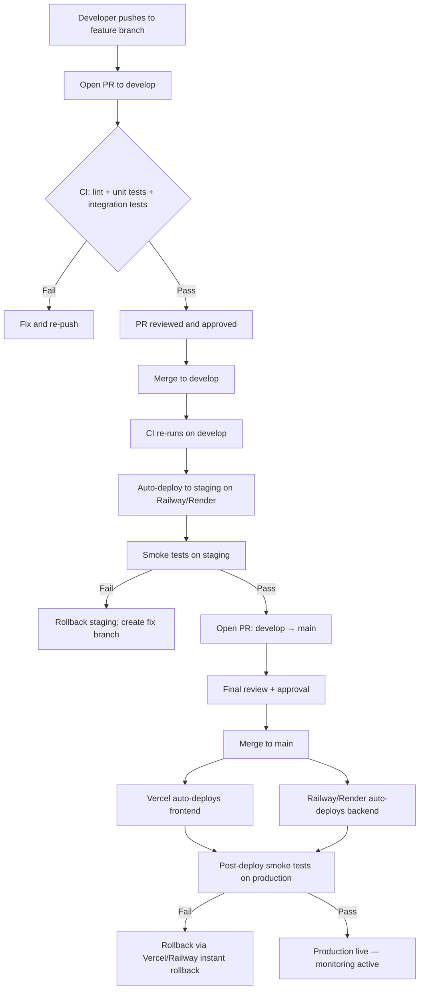

# Deployment.md
# Deployment Guide
## AI Resume Analyzer & Career Assistant

**Document Version:** 1.0
**Document Type:** Deployment Guide
**Reference:** SRS v1.0, Architecture v1.0, API v1.0, Database v1.0, Development-Roadmap v1.0, Testing-Strategy v1.0
**Stack:** React (Vite) + Node.js/Express + MongoDB Atlas + Google Gemini API
**Hosting:** Vercel (Frontend) · Render or Railway (Backend) · MongoDB Atlas (Database)
**Status:** Ready for Production

---

## Table of Contents

1. Deployment Overview
2. Environment Setup
3. Frontend Deployment
4. Backend Deployment
5. Database Deployment
6. AI Deployment
7. Security Checklist
8. CI/CD Strategy
9. Monitoring
10. Backup & Disaster Recovery
11. Production Checklist
12. Future Scaling

---

## 1. Deployment Overview

### 1.1 Purpose

This document defines every step required to deploy the AI Resume Analyzer & Career Assistant from a local development machine to a fully operational, monitored, production environment. It covers environment configuration, hosting platform setup, database hardening, AI API management, security controls, and post-deployment verification.

### 1.2 Architecture

The application is deployed as three independently managed units, consistent with Architecture.md §13 and SRS §22:

| Unit | Technology | Hosting Platform |
|---|---|---|
| Frontend SPA | React (Vite) + Tailwind CSS | Vercel |
| Backend REST API | Node.js + Express.js | Render or Railway |
| Database | MongoDB Atlas (managed) | MongoDB Atlas Cloud |
| AI Engine | Google Gemini API | External (Google Cloud) |
| File Storage | Cloud object storage (S3-compatible) | AWS S3 / Cloudflare R2 / Supabase Storage |
| Error Monitoring | Sentry | Sentry Cloud |
| Uptime Monitoring | UptimeRobot | UptimeRobot Cloud |

### 1.3 Deployment Strategy

- **Frontend:** Continuous deployment via Vercel Git integration. Every merge to `main` triggers an automatic production build and deployment.
- **Backend:** Manual-trigger or auto-deploy on Railway/Render from the `main` branch after all tests pass.
- **Database:** MongoDB Atlas is always-on managed infrastructure. Schema/index changes are applied via migration scripts run before each backend deploy.
- **Zero-downtime goal:** Vercel provides atomic deployments with instant rollback. Railway/Render supports rolling restarts. MongoDB Atlas supports live scaling without downtime.

### 1.4 Production Workflow
Developer pushes to feature branch
↓
Pull Request opened → CI runs unit + integration tests
↓
PR approved and merged to develop
↓
Staging deploy triggered (Railway staging service)
↓
Smoke tests run on staging
↓
PR from develop → main approved
↓
Production deploy triggered
├── Vercel builds and deploys frontend automatically
└── Railway/Render deploys backend (auto or manual trigger)
↓
Post-deploy smoke tests run on production
↓
Monitoring confirms healthy state

---

## 2. Environment Setup

### 2.1 Environments

| Environment | Purpose | Frontend URL | Backend URL | Database |
|---|---|---|---|---|
| `development` | Local development | `http://localhost:5173` | `http://localhost:5000` | Local or Atlas dev cluster |
| `staging` | Pre-production validation | `https://staging.<your-app>.vercel.app` | `https://api-staging.<your-app>.up.railway.app` | Atlas staging cluster |
| `production` | Live application | `https://<your-domain>.com` | `https://api.<your-domain>.com` | Atlas production cluster |

### 2.2 Required Software (Local Development)

| Tool | Version | Purpose |
|---|---|---|
| Node.js | 20.x LTS (minimum 18.x) | Backend runtime + Vite build |
| npm | 10.x (bundled with Node 20) | Package management |
| Git | 2.40+ | Version control |
| MongoDB Compass | Latest | Local DB inspection (optional) |
| Postman / Insomnia | Latest | API testing during development |
| VS Code | Latest | Recommended IDE |

Verify Node version:
node --version   # must be >= 18.0.0
npm --version    # must be >= 9.0.0

Use `nvm` (Node Version Manager) to manage Node versions:
nvm install 20
nvm use 20
nvm alias default 20

### 2.3 Environment Variables

#### Backend `.env` (development)
Server
NODE_ENV=development
PORT=5000
MongoDB
MONGODB_URI=mongodb+srv://<user>:<password>@cluster0.xxxxx.mongodb.net/ai-resume-dev?retryWrites=true&w=majority
JWT
JWT_ACCESS_SECRET=<random-64-char-string>
JWT_REFRESH_SECRET=<random-64-char-string>
JWT_ACCESS_EXPIRES_IN=15m
JWT_REFRESH_EXPIRES_IN=7d
Google Gemini
GEMINI_API_KEY=<your-gemini-api-key>
GEMINI_MODEL=gemini-1.5-pro
File Storage
STORAGE_PROVIDER=s3
AWS_ACCESS_KEY_ID=<your-access-key>
AWS_SECRET_ACCESS_KEY=<your-secret-key>
AWS_REGION=ap-south-1
AWS_BUCKET_NAME=ai-resume-dev
Email (password reset)
SMTP_HOST=smtp.mailtrap.io
SMTP_PORT=587
SMTP_USER=<mailtrap-user>
SMTP_PASS=<mailtrap-pass>
EMAIL_FROM=noreply@ai-resume.com
CORS
ALLOWED_ORIGINS=http://localhost:5173
Rate Limiting
RATE_LIMIT_WINDOW_MS=900000
RATE_LIMIT_MAX=100
Sentry (optional in dev)
SENTRY_DSN=

#### Frontend `.env` (development)
VITE_API_BASE_URL=http://localhost:5000/api/v1
VITE_APP_NAME=AI Resume Analyzer
VITE_SENTRY_DSN=

#### Production Environment Variables — Backend

All variables above, with these changes:
NODE_ENV=production
MONGODB_URI=<production-atlas-uri>
ALLOWED_ORIGINS=https://<your-production-domain>.com
SMTP_HOST=<production-smtp-host>
SENTRY_DSN=<production-sentry-dsn>

#### Production Environment Variables — Frontend
VITE_API_BASE_URL=https://api.<your-domain>.com/api/v1
VITE_SENTRY_DSN=<production-sentry-dsn>

> **Security Rule:** Never commit any `.env` file to git. The `.gitignore` must include `.env`, `.env.*`, and `.env.local`. Commit only a `.env.example` with placeholder values and no real secrets.

---

## 3. Frontend Deployment

### 3.1 Build Process

The frontend is built with Vite. The production build outputs optimized static assets to the `dist/` directory.

Build command:
cd frontend
npm install
npm run build

Output: `frontend/dist/` — static HTML, CSS, JS bundles ready for CDN delivery.

Preview the production build locally before deploying:
npm run preview

### 3.2 Configuration

`vite.config.js` must define the output directory and any aliases used in the project. Ensure the following for production:

- `base: '/'` — correct for Vercel root deployments
- Code splitting enabled (Vite default) — reduces initial bundle size
- Source maps disabled in production (or uploaded to Sentry only, not served publicly)
- Environment variables with `VITE_` prefix are inlined at build time — verify no secrets are prefixed with `VITE_`

### 3.3 Vercel Setup

**Step 1 — Connect Repository**
1. Log in to [vercel.com](https://vercel.com)
2. Click "Add New Project" → Import from GitHub
3. Select the frontend repository (or monorepo root)
4. Set **Root Directory** to `frontend/` if using a monorepo

**Step 2 — Build Settings**

| Setting | Value |
|---|---|
| Framework Preset | Vite |
| Build Command | `npm run build` |
| Output Directory | `dist` |
| Install Command | `npm install` |
| Node.js Version | 20.x |

**Step 3 — Environment Variables**

In Vercel project settings → Environment Variables, add:

| Variable | Environment |
|---|---|
| `VITE_API_BASE_URL` | Production, Preview, Development |
| `VITE_APP_NAME` | All |
| `VITE_SENTRY_DSN` | Production |

**Step 4 — Deploy**

Click "Deploy". Vercel builds the project and provides a deployment URL. Every subsequent push to `main` triggers an automatic redeploy.

### 3.4 Domain Configuration

1. In Vercel project → Settings → Domains, add your custom domain (e.g., `app.yourdomain.com`)
2. Add a CNAME record in your DNS provider pointing to `cname.vercel-dns.com`
3. Vercel automatically provisions a free TLS certificate via Let's Encrypt
4. Enable "Redirect www to non-www" (or vice versa) in Vercel domain settings
5. Set `HSTS` header via `vercel.json`:

```json
{
  "headers": [
    {
      "source": "/(.*)",
      "headers": [
        { "key": "Strict-Transport-Security", "value": "max-age=63072000; includeSubDomains; preload" },
        { "key": "X-Content-Type-Options", "value": "nosniff" },
        { "key": "X-Frame-Options", "value": "DENY" },
        { "key": "Referrer-Policy", "value": "strict-origin-when-cross-origin" }
      ]
    }
  ],
  "rewrites": [
    { "source": "/(.*)", "destination": "/index.html" }
  ]
}
```

The `rewrites` rule is critical for React Router — all paths must serve `index.html` and let the client-side router handle navigation.

### 3.5 Caching

Vite generates content-hashed filenames for all JS/CSS bundles (e.g., `index-a1b2c3d4.js`). Configure Vercel cache headers via `vercel.json`:

```json
{
  "headers": [
    {
      "source": "/assets/(.*)",
      "headers": [{ "key": "Cache-Control", "value": "public, max-age=31536000, immutable" }]
    },
    {
      "source": "/index.html",
      "headers": [{ "key": "Cache-Control", "value": "no-cache, no-store, must-revalidate" }]
    }
  ]
}
```

- Static assets (`/assets/*`): cached for 1 year (content-hashed filenames guarantee cache busting)
- `index.html`: never cached (ensures users always get the latest app version)

### 3.6 Performance Optimization

- Enable Vercel Edge Network (automatic — all Vercel deployments use CDN)
- Enable Vite's automatic chunk splitting — large dependencies (Recharts, React Router) split into separate chunks
- Lazy-load heavy pages using `React.lazy()` and `Suspense` — analysis result page, charts page
- Compress images in `public/` directory before committing (use `squoosh` or `sharp`)
- Use `vite-plugin-compression` to generate `.gz` and `.br` files — Vercel serves them automatically

---

## 4. Backend Deployment

### 4.1 Render Setup

**Step 1 — Create Web Service**
1. Log in to [render.com](https://render.com)
2. New → Web Service → Connect GitHub repository
3. Select the backend repository (or set root directory to `backend/`)

**Step 2 — Configure Service**

| Setting | Value |
|---|---|
| Environment | Node |
| Build Command | `npm install` |
| Start Command | `node src/server.js` |
| Node Version | 20 (set via `.node-version` file or environment variable `NODE_VERSION=20`) |
| Instance Type | Starter ($7/month) minimum for production |
| Auto-Deploy | Yes (on push to `main`) |
| Health Check Path | `/api/v1/health` |

**Step 3 — Add Environment Variables**

In Render service → Environment, add all backend production environment variables (see Section 2.3).

### 4.2 Railway Setup (Alternative)

**Step 1 — Create Project**
1. Log in to [railway.app](https://railway.app)
2. New Project → Deploy from GitHub repo
3. Select repository; Railway auto-detects Node.js

**Step 2 — Configure**

| Setting | Value |
|---|---|
| Start Command | `node src/server.js` |
| Build Command | `npm install` |
| Watch Paths | `backend/**` (for monorepo) |
| Health Check | `GET /api/v1/health` |

**Step 3 — Custom Domain**

In Railway service → Settings → Domains, add a custom domain (e.g., `api.yourdomain.com`). Railway provisions TLS automatically.

### 4.3 Environment Variables

Set all variables listed in Section 2.3 (production values) in the Render/Railway dashboard. Never hardcode values in source code.

Required production variables checklist:

- [ ] `NODE_ENV=production`
- [ ] `PORT` (Render/Railway inject this automatically — do not hardcode)
- [ ] `MONGODB_URI` (production Atlas connection string)
- [ ] `JWT_ACCESS_SECRET` (minimum 64 random characters)
- [ ] `JWT_REFRESH_SECRET` (minimum 64 random characters, different from access secret)
- [ ] `GEMINI_API_KEY`
- [ ] `AWS_ACCESS_KEY_ID` + `AWS_SECRET_ACCESS_KEY` + `AWS_REGION` + `AWS_BUCKET_NAME`
- [ ] `ALLOWED_ORIGINS` (production frontend URL only)
- [ ] `SENTRY_DSN`
- [ ] `SMTP_*` (production email provider)

### 4.4 API Configuration

- Ensure `PORT` is read from `process.env.PORT` — Render/Railway inject the port dynamically
- Configure Express to trust the proxy: `app.set('trust proxy', 1)` — required for correct IP detection behind Render/Railway's load balancer (needed for rate limiting)
- Helmet.js must be active in production for security headers
- Morgan logging level: `combined` format in production (structured logs for Railway/Render log aggregation)

### 4.5 Security

- Run `npm audit` before every production deploy; block deploy if critical CVEs found
- Set `NODE_ENV=production` — disables Express error stack traces in responses
- Disable `X-Powered-By` header: `app.disable('x-powered-by')` (also handled by Helmet)
- Enable HTTPS-only: enforce via `Strict-Transport-Security` header (handled by reverse proxy / Render/Railway)
- Body size limit: `express.json({ limit: '10kb' })` for JSON endpoints; `multer` size limit for file uploads

### 4.6 Logging

Use `morgan` for HTTP access logs and a structured logger (e.g., `winston` or `pino`) for application logs:

| Log Level | When Used |
|---|---|
| `error` | Unhandled exceptions, AI failures, DB connection errors |
| `warn` | Retry attempts, rate limit triggers, deprecated usage |
| `info` | Successful requests, analysis completions, user actions |
| `debug` | Development only — detailed request/response, Gemini prompt contents |

In production: log level set to `info` minimum. Never log passwords, JWT tokens, or resume content in plaintext.

### 4.7 Health Checks

Implement a health check endpoint that Render/Railway polls to determine service health:
GET /api/v1/health

Response (200 OK):
```json
{
  "status": "ok",
  "timestamp": "2025-01-15T10:30:00.000Z",
  "uptime": 3600,
  "environment": "production",
  "database": "connected",
  "version": "1.0.0"
}
```

The health check must verify MongoDB connectivity. If the database is unreachable, return `503 Service Unavailable`.

### 4.8 Restart Policy

- **Render:** Configure "Auto-Deploy" and set restart policy to restart on crash (Render default)
- **Railway:** Enable "Restart on Failure" in service settings
- **Process manager:** For custom VPS, use PM2 with `pm2 start src/server.js --name api --restart-delay=3000 --max-restarts=10`
- Set a startup delay of 3 seconds between restarts to prevent crash loops on bad environment configuration

---

## 5. Database Deployment

### 5.1 MongoDB Atlas Configuration

**Step 1 — Create Organization and Project**
1. Log in to [cloud.mongodb.com](https://cloud.mongodb.com)
2. Create Organization: `AI Resume Analyzer`
3. Create Projects: `development`, `staging`, `production`

**Step 2 — Create Clusters**

| Environment | Cluster Tier | Region |
|---|---|---|
| Development | M0 (Free) | Same region as backend |
| Staging | M0 (Free) or M10 | Same region as backend |
| Production | M10 ($57/month minimum) | Same region as Railway/Render deployment |

For production, choose M10 or higher for:
- Dedicated RAM
- Automated backups
- Performance advisor
- No connection throttling

**Step 3 — Database User**

For each environment, create a dedicated database user:
- Username: `api-production` (not `admin`)
- Role: `readWrite` on the application database only (not `atlasAdmin`)
- Authentication: SCRAM-SHA-256 password
- Store credentials in the backend environment variables as `MONGODB_URI`

**Step 4 — Connection String**

Format:
mongodb+srv://<username>:<password>@<cluster>.mongodb.net/<database>?retryWrites=true&w=majority&appName=ai-resume-production

Use the `appName` parameter for Atlas monitoring visibility.

### 5.2 Security

**Network Access:**
- Development: Temporarily allow `0.0.0.0/0` (all IPs) for local dev
- Staging/Production: Add only the static outbound IPs of the Railway/Render deployment region
- If Railway/Render does not provide static IPs (free tier): use MongoDB Atlas VPC Peering or Atlas Private Endpoints (paid tier), or configure IP allowlist for the deployment region's IP ranges

**Encryption:**
- Encryption at rest: enabled by default on M10+ clusters
- Encryption in transit: TLS 1.2+ enforced by default on all Atlas connections

**Auditing (M10+):**
- Enable Atlas Audit Logs for production: log all `authenticate`, `createCollection`, `dropCollection`, and `find` operations

### 5.3 Indexes

Run the following index creation script against the production database after the first deployment and before any user traffic. These indexes are defined in Database.md:

| Collection | Index | Type | Purpose |
|---|---|---|---|
| `users` | `{ email: 1 }` | Unique | Login lookup |
| `resumes` | `{ userId: 1, createdAt: -1 }` | Compound | Resume list per user, sorted by date |
| `resumes` | `{ contentHash: 1 }` | Standard | Duplicate/cache detection |
| `analyses` | `{ resumeId: 1, createdAt: -1 }` | Compound | Latest analysis per resume |
| `analyses` | `{ userId: 1 }` | Standard | Analytics queries |
| `jobDescriptions` | `{ userId: 1 }` | Standard | JD list per user |
| `coverLetters` | `{ userId: 1 }` | Standard | Cover letter list per user |
| `reports` | `{ userId: 1 }` | Standard | Report list per user |
| `refreshTokens` | `{ token: 1 }` | Unique | Token lookup on refresh |
| `refreshTokens` | `{ expiresAt: 1 }` | TTL | Auto-expire old tokens |

### 5.4 Backups

**Atlas Automated Backups (M10+):**
- Enable "Continuous Cloud Backup" on the production cluster
- Retention: 7 days of continuous backup (point-in-time restore to any second)
- Monthly snapshots retained for 12 months

**Manual Snapshot Before Migrations:**
Before any schema change or major deployment, trigger a manual snapshot:
Atlas UI → Clusters → Backups → Take Snapshot Now

**Backup Verification:**
Monthly — restore a backup to a temporary Atlas cluster and verify data integrity.

### 5.5 Scaling

| Trigger | Action |
|---|---|
| CPU > 70% sustained | Upgrade cluster tier (M10 → M20 → M30) |
| RAM usage > 80% | Upgrade tier for larger RAM allocation |
| Connections > 80% of limit | Enable connection pooling via Atlas Data API or add replica set members |
| Read throughput scaling | Add read replicas to the Atlas replica set |
| Write throughput scaling | Consider sharding (MongoDB Atlas Global Clusters) — post-MVP |

### 5.6 Monitoring

Enable the following in Atlas:
- **Performance Advisor:** Suggests index improvements based on slow query log
- **Real-time Performance Panel:** Monitor ops/sec, connections, network throughput
- **Atlas Alerts:** Configure alerts for:
  - Connections > 80% of max
  - Query execution time > 1 second
  - Disk usage > 80%
  - Replica set election (unexpected failover)
- Integrate Atlas with Datadog or PagerDuty for centralized alerting (optional Phase 2)

---

## 6. AI Deployment

### 6.1 Gemini API Configuration

- Model: `gemini-1.5-pro` (primary, as defined in Architecture.md §1.2)
- SDK: `@google/generative-ai` (official Google Node.js SDK)
- API calls are made exclusively server-side — the `GEMINI_API_KEY` is never exposed to the frontend
- Configure `responseMimeType: "application/json"` and `temperature: 0.3` per AI-Prompts.md
- Set `maxOutputTokens: 4096` for analysis responses

### 6.2 API Key Management

- Generate a dedicated API key for each environment (development, staging, production) in Google Cloud Console → APIs & Services → Credentials
- Restrict each key:
  - **Application restrictions:** None (server-side key — no HTTP referrer restriction)
  - **API restrictions:** Restrict to "Generative Language API" only
- Store in environment variables only; never in source code, config files, or logs
- Rotate API keys every 90 days
- Monitor key usage in Google Cloud Console → Billing → Reports

### 6.3 Rate Limits

As of Gemini 1.5 Pro (verify current limits in Google AI Studio):

| Limit Type | Default (Free) | Paid Tier |
|---|---|---|
| Requests per minute (RPM) | 15 RPM | 1000+ RPM |
| Tokens per minute (TPM) | 1M TPM | Higher |
| Requests per day (RPD) | 1500 RPD | Unlimited |

**Production recommendation:** Upgrade to the Gemini API paid tier before public launch to avoid RPM throttling from concurrent users.

### 6.4 Retry Strategy

Implement exponential backoff for all Gemini API calls:

| Attempt | Delay Before Retry |
|---|---|
| 1st retry | 1 second |
| 2nd retry | 4 seconds |
| 3rd retry | 9 seconds |
| After 3rd failure | Return `503` to client |

Retry conditions:
- HTTP 429 (rate limit)
- HTTP 500/503 (server error)
- JSON parse failure (malformed response)
- Schema validation failure (missing required fields)

Do NOT retry on:
- HTTP 400 (bad request — prompt issue, fix the prompt)
- HTTP 401/403 (auth — fix the API key)

### 6.5 Monitoring

Track the following metrics for all Gemini API calls:
- Request count (per endpoint, per user)
- Success rate (% returning valid schema-conforming JSON on first attempt)
- Retry rate (% requiring 1+, 2+, 3 retries)
- Average response latency (ms)
- Token usage per request (log `usage.totalTokenCount` from Gemini response)
- Error rate by error type (429, 500, parse failure, schema failure)

Log all of the above to the application logger at `info` level. Aggregate in Sentry or Datadog.

### 6.6 Fallback Strategy

When Gemini is unavailable (all retries exhausted):

1. Return `503 Service Unavailable` to the client with body:
```json
   {
     "success": false,
     "error": {
       "code": "AI_SERVICE_UNAVAILABLE",
       "message": "AI analysis is temporarily unavailable. Your resume has been saved. Please try again in a few minutes.",
       "retryAfter": 60
     }
   }
```
2. Resume data is preserved in MongoDB — the user does not need to re-upload
3. The frontend displays a non-blocking error banner with a "Retry Analysis" button
4. Log the outage event to Sentry with full error details
5. If outage persists > 10 minutes: trigger an alert via UptimeRobot/Sentry to the engineering team

---

## 7. Security Checklist

### 7.1 HTTPS

- [ ] Frontend served exclusively over HTTPS (Vercel enforces this by default)
- [ ] Backend served exclusively over HTTPS (Render/Railway enforce this by default)
- [ ] HTTP → HTTPS redirect enabled (Vercel and Render/Railway handle this)
- [ ] `Strict-Transport-Security` header set: `max-age=63072000; includeSubDomains; preload`
- [ ] TLS 1.2 minimum enforced (both platforms enforce this by default)
- [ ] SSL certificate valid and auto-renewing (Let's Encrypt via Vercel/Render/Railway)

### 7.2 JWT Secrets

- [ ] `JWT_ACCESS_SECRET` is a random string of ≥ 64 characters (use `openssl rand -base64 64`)
- [ ] `JWT_REFRESH_SECRET` is different from `JWT_ACCESS_SECRET`
- [ ] Neither secret appears anywhere in the source code or git history
- [ ] Secrets are rotated every 90 days; all existing sessions invalidated on rotation
- [ ] Access token expiry: 15 minutes
- [ ] Refresh token expiry: 7 days
- [ ] Refresh tokens stored hashed in MongoDB, not as plaintext

### 7.3 Environment Variables

- [ ] `.env` files are in `.gitignore`
- [ ] `.env.example` committed with placeholder values only
- [ ] All secrets stored in the hosting platform's environment variable store (not in config files)
- [ ] `git log --all --full-history --grep="SECRET\|KEY\|PASSWORD"` returns no accidental commits
- [ ] Production and development use separate API keys (Gemini, AWS, SMTP)

### 7.4 CORS

- [ ] `ALLOWED_ORIGINS` set to the exact production frontend URL (no trailing slash, no wildcards)
- [ ] CORS middleware applied before all routes
- [ ] `credentials: true` only if HTTP-only cookies are used for token transport
- [ ] Preflight `OPTIONS` responses include correct `Access-Control-Allow-Methods` and `Access-Control-Allow-Headers`
- [ ] No `Access-Control-Allow-Origin: *` in production

### 7.5 Helmet

- [ ] `helmet()` middleware applied to all Express routes
- [ ] Content Security Policy (CSP) configured to restrict script sources
- [ ] `X-Frame-Options: DENY` (prevents clickjacking)
- [ ] `X-Content-Type-Options: nosniff`
- [ ] `Referrer-Policy: strict-origin-when-cross-origin`

### 7.6 File Upload Security

- [ ] File size limit enforced at multer level: 5MB maximum
- [ ] File MIME type validated server-side (not just file extension): `application/pdf` and `application/vnd.openxmlformats-officedocument.wordprocessingml.document`
- [ ] Original filename sanitized before storage (no path traversal characters)
- [ ] Files stored in cloud object storage, not on the server filesystem
- [ ] Uploaded files are not publicly accessible by default; access via signed URLs only
- [ ] No executable file types accepted (`.exe`, `.sh`, `.js`, etc.)

### 7.7 Rate Limiting

- [ ] `express-rate-limit` middleware applied to all routes
- [ ] Custom limits on sensitive endpoints (auth login, register, analysis) — see Testing-Strategy.md §7.6
- [ ] `trust proxy` set so rate limiting uses real client IP behind Render/Railway proxy
- [ ] `429 Too Many Requests` responses include `Retry-After` header
- [ ] Rate limit events logged at `warn` level

### 7.8 Input Validation

- [ ] `express-validator` applied to all POST/PATCH request bodies
- [ ] MongoDB ObjectId parameters validated before DB query (invalid format → 400, not 500)
- [ ] Resume text sanitized with `DOMPurify` (server-side) before sending to Gemini
- [ ] AI-generated text sanitized before storage and before rendering in the frontend
- [ ] Job description text: min 50 chars, max 10,000 chars
- [ ] Email: valid format, lowercase normalized
- [ ] Password: minimum 8 characters enforced at registration

---

## 8. CI/CD Strategy

### 8.1 GitHub Workflow

Two GitHub Actions workflows are defined:

**Workflow 1: `ci.yml` — runs on every PR to `develop`**
Trigger: Pull Request → develop branch
Steps:

Checkout code
Setup Node.js 20
Install dependencies (npm ci)
Run ESLint (npm run lint)
Run unit tests (npm test -- --coverage)
Run integration tests (npm run test:integration)
Check coverage threshold (≥ 70%)
Run npm audit (fail on critical CVEs)


**Workflow 2: `deploy.yml` — runs on merge to `main`**
Trigger: Push to main branch
Steps:

Run full CI pipeline (same as above)
Deploy backend to Railway/Render (via API trigger or git integration)
Vercel auto-deploys frontend (triggered by git push automatically)
Run smoke tests against staging (if staging branch) or production
Notify team on success/failure (via Slack webhook or GitHub notification)


### 8.2 Branch Strategy

Consistent with Development-Roadmap.md §6:

| Branch | Purpose | CI/CD Action |
|---|---|---|
| `feature/*` | Feature development | CI runs on PR open/update |
| `develop` | Integration | CI + staging deploy |
| `main` | Production | CI + production deploy |
| `hotfix/*` | Emergency production fixes | CI + production deploy (expedited) |

### 8.3 Build Process

**Frontend build verification (in CI):**
cd frontend
npm ci
npm run build    # Vite build — fails on TypeScript/import errors
npm run lint     # ESLint check
npm run test     # Vitest unit tests

**Backend build verification (in CI):**
cd backend
npm ci
npm run lint
npm test -- --coverage --coverageThreshold='{"global":{"lines":70}}'
npm run test:integration
npm audit --audit-level=critical

### 8.4 Deployment Pipeline



### 8.5 Rollback Strategy

**Frontend (Vercel):**
- Vercel retains all previous deployments
- Rollback: Vercel Dashboard → Deployments → Select previous deployment → "Promote to Production"
- Time to rollback: < 30 seconds

**Backend (Render):**
- Render retains the last 5 deploys
- Rollback: Render Dashboard → Service → Deploys → Select previous deploy → "Rollback"
- Time to rollback: 1–2 minutes

**Backend (Railway):**
- Railway retains deploy history
- Rollback: Railway Dashboard → Service → Deployments → Select previous → "Redeploy"
- Time to rollback: 1–2 minutes

**Database:**
- No rollback of database schema changes — use additive-only migrations
- If destructive migration deployed accidentally: restore from Atlas point-in-time backup
- Target RTO (Recovery Time Objective): < 30 minutes for database rollback

---

## 9. Monitoring

### 9.1 Application Logs

- **Tool:** Platform-native logging (Railway/Render log drain) + optional Winston/Pino structured logs
- **Log format:** JSON structured logging in production (`{ timestamp, level, message, requestId, userId, ... }`)
- **Log retention:** 7 days on Railway/Render free tier; upgrade to 30 days for production
- **Log shipping:** Configure Railway/Render log drain to ship to Datadog, Logtail, or Papertrail for longer retention and search

### 9.2 API Logs

Morgan `combined` format logs every HTTP request:
::1 - - [15/Jan/2025:10:30:00 +0000] "POST /api/v1/resumes/upload HTTP/1.1" 201 1024 "-" "Mozilla/5.0..."

Track:
- Request method, path, status code, response time
- User ID (if authenticated) — added as a custom Morgan token
- Request ID (UUID) — for tracing a request across log lines

### 9.3 Error Logs

- **Tool:** Sentry (frontend + backend)
- **Frontend:** `@sentry/react` — captures unhandled JS errors, React component errors, network request failures
- **Backend:** `@sentry/node` — captures unhandled exceptions, Express route errors, and manually reported errors
- **Alert configuration:** Sentry sends email/Slack alert on:
  - New error type (never seen before)
  - Error frequency > 10 occurrences in 1 hour
  - Any Critical-severity error

### 9.4 Performance Metrics

Track the following via application logs and optionally a Datadog/New Relic APM agent:

| Metric | Target | Alert Threshold |
|---|---|---|
| API response time (p95) | < 500ms | > 1 second |
| AI analysis response time | < 25 seconds | > 30 seconds |
| Error rate (5xx) | < 0.5% | > 1% |
| Uptime | > 99.5% | Any downtime > 5 minutes |

**UptimeRobot:**
- Monitor `GET https://api.<your-domain>.com/api/v1/health` every 5 minutes
- Alert via email + SMS if response is not `200 OK` within 10 seconds
- Status page: configure a public status page for user-facing incident communication

### 9.5 Database Monitoring

- MongoDB Atlas built-in monitoring (always active on M10+)
- Track: connections, query execution time, index hit rate, disk usage, replication lag
- Atlas Alerts configured for:
  - Connections > 80% of cluster maximum
  - Slow queries > 1 second
  - Disk usage > 80%
  - Replica set election event

### 9.6 AI Usage Monitoring

Log the following for every Gemini API call in the application logger:

```json
{
  "event": "gemini_api_call",
  "endpoint": "resume_analysis",
  "resumeId": "...",
  "userId": "...",
  "attempt": 1,
  "success": true,
  "latencyMs": 8432,
  "totalTokens": 2841,
  "schemaValid": true
}
```

Weekly review: token usage vs. budget; success rate; average latency trend.

---

## 10. Backup & Disaster Recovery

### 10.1 Database Backup

| Backup Type | Frequency | Retention | Tool |
|---|---|---|---|
| Continuous backup | Real-time | 7 days (point-in-time) | MongoDB Atlas Continuous Cloud Backup |
| Daily snapshot | Every 24 hours | 7 days | Atlas automated snapshots |
| Weekly snapshot | Every 7 days | 4 weeks | Atlas automated snapshots |
| Monthly snapshot | Every 30 days | 12 months | Atlas automated snapshots |
| Pre-deployment snapshot | Before each major deploy | 30 days | Manual trigger in Atlas |

### 10.2 File Backup

Resume files and generated PDF reports stored in S3-compatible object storage:
- Enable S3 Versioning on the production bucket — retains all versions of every file
- Enable S3 Replication to a second region bucket for geographic redundancy
- Lifecycle policy: archive files to S3 Glacier after 90 days if not accessed (cost optimization)

### 10.3 Recovery Process

**Scenario 1: Accidental data deletion (single document)**
1. Identify the deletion timestamp from application logs
2. Atlas UI → Clusters → Backups → Point-in-Time Restore
3. Restore to a new temporary cluster at the timestamp before deletion
4. Export the specific document using `mongodump` or Atlas Data Explorer
5. Import the document back into the production cluster
5. Verify integrity; delete temporary cluster

**Scenario 2: Database cluster failure**
1. Atlas automatically promotes a replica set secondary to primary — RTO < 30 seconds for automatic failover
2. If cluster is permanently lost: restore from latest daily snapshot to a new cluster
3. Update `MONGODB_URI` environment variable in Railway/Render to point to restored cluster
4. Restart backend service
5. Verify health check and run smoke tests

**Scenario 3: Backend service outage**
1. Check Railway/Render service logs for crash reason
2. If environment variable issue: fix in dashboard → manual redeploy
3. If code bug: revert to previous deployment (see Section 8.5 rollback)
4. If platform outage: monitor Railway/Render status page; no action required beyond communication

**Scenario 4: Frontend outage**
1. Vercel has 99.99% SLA — full platform outages are rare
2. If Vercel is down: serve cached version from CDN edge (Vercel edge nodes retain last deployment)
3. If custom domain DNS issue: verify CNAME record points to `cname.vercel-dns.com`

### 10.4 Recovery Time Objectives

| Scenario | RTO Target | RPO Target |
|---|---|---|
| MongoDB primary failover (replica set) | < 30 seconds | 0 (no data loss) |
| Backend crash + auto-restart | < 60 seconds | 0 |
| Full backend redeploy (rollback) | < 5 minutes | 0 |
| Database restore from snapshot | < 30 minutes | < 24 hours |
| Frontend rollback (Vercel) | < 1 minute | 0 |
| Full disaster recovery (cluster loss) | < 2 hours | < 24 hours |

---

## 11. Production Checklist

### Before Deployment

**Infrastructure:**
- [ ] MongoDB Atlas production cluster created (M10+) with backups enabled
- [ ] Production database user created with `readWrite` role only
- [ ] IP allowlist configured for Railway/Render outbound IPs
- [ ] All database indexes created and verified
- [ ] S3 bucket created with versioning and replication enabled
- [ ] Sentry projects created for frontend and backend
- [ ] UptimeRobot monitors configured

**Configuration:**
- [ ] All production environment variables set in Vercel and Railway/Render
- [ ] No placeholder or development values in production env vars
- [ ] `NODE_ENV=production` confirmed
- [ ] `ALLOWED_ORIGINS` set to exact production frontend URL
- [ ] JWT secrets are 64+ random characters, different from each other
- [ ] Gemini API key is the production key (separate from dev key)

**Code:**
- [ ] All unit and integration tests passing (`npm test`)
- [ ] No critical or high severity bugs open
- [ ] `npm audit` shows zero critical CVEs
- [ ] ESLint passes with zero errors
- [ ] No `console.log` statements left in production code (use logger)
- [ ] No hardcoded secrets, URLs, or credentials in source code
- [ ] `vercel.json` includes rewrite rule for React Router

### During Deployment

- [ ] Backend deployed first (database schema must be ready before frontend)
- [ ] Database index creation script run against production Atlas
- [ ] Backend health check confirmed: `GET /api/v1/health` returns `200`
- [ ] Frontend deployed to Vercel
- [ ] Custom domain DNS configured and propagating
- [ ] TLS certificate provisioned and valid

### After Deployment

- [ ] Full smoke test suite run on production (see Testing-Strategy.md §2.6)
- [ ] End-to-end user journey completed manually on production (register → upload → analyze → download report)
- [ ] Sentry receiving events (trigger a test error to verify DSN is correct)
- [ ] UptimeRobot shows green status
- [ ] No unexpected 5xx errors in Railway/Render logs in first 10 minutes
- [ ] Performance: AI analysis completing within 25 seconds on production
- [ ] Dark mode and light mode verified on production
- [ ] Mobile layout verified on production (375px viewport)

### Monitoring Checklist (Ongoing)

- [ ] Review Sentry weekly for new error types
- [ ] Review Atlas Performance Advisor weekly for index recommendations
- [ ] Review Gemini API usage monthly vs. quota and budget
- [ ] Review Railway/Render resource usage monthly (CPU, RAM, bandwidth)
- [ ] Run `npm audit` monthly; apply security patches
- [ ] Rotate JWT secrets and API keys every 90 days
- [ ] Test backup restore quarterly

---

## 12. Future Scaling

### 12.1 Load Balancer

When single backend instance becomes a bottleneck (CPU > 70% sustained):
- Railway/Render both support horizontal scaling: increase replica count in service settings
- Requests are distributed across replicas by the platform's built-in load balancer
- Ensure all backend instances are stateless (JWT auth, no in-memory session) — confirmed by Architecture.md §1.4

### 12.2 Redis (Caching Layer)

Phase 2 addition (Architecture.md §1.2):
- Use **Upstash Redis** (serverless, per-request billing) for Railway/Render compatibility
- Cache AI analysis results keyed by `contentHash` (already designed in Architecture.md §1.4)
- Cache user session metadata to reduce MongoDB reads on every authenticated request
- Implement Bull queue backed by Redis for async AI analysis processing (decouples HTTP response from long-running Gemini calls)

### 12.3 CDN

- Vercel Edge Network already serves frontend assets globally (built-in CDN)
- For API responses: add Cloudflare in front of the backend for DDoS protection and caching of public endpoints
- For file storage: use Cloudflare R2 or CloudFront in front of S3 for resume/report file delivery

### 12.4 Docker

For consistent deployment and local environment parity:
- Add `Dockerfile` to backend: multi-stage build (build stage → production stage with `node:20-alpine`)
- Add `docker-compose.yml` for local development: runs backend + MongoDB + Redis together
- Deploy Docker container to Railway (Railway supports Docker natively) or migrate to AWS ECS/GCP Cloud Run

### 12.5 Kubernetes

For production-scale deployment (> 10,000 daily active users):
- Migrate Docker containers to a Kubernetes cluster (AWS EKS, GCP GKE, or DigitalOcean Kubernetes)
- Define Kubernetes Deployments, Services, HPA (Horizontal Pod Autoscaler) for backend
- Use Kubernetes Secrets for environment variable management
- Implement rolling updates and readiness probes (replacing current Render/Railway health checks)

### 12.6 Microservices

When the monolithic backend reaches scale limits, extract services along these seams (already designed in Architecture.md §1.4):
- `auth-service` — JWT issuance, refresh, user management
- `resume-service` — upload, parsing, storage
- `ai-service` — Gemini orchestration, prompt management, caching
- `report-service` — PDF generation
- `notification-service` — email delivery

Services communicate via REST or a message broker (RabbitMQ or AWS SQS).

### 12.7 Serverless

Alternative scaling path for AI-heavy workloads:
- Move AI analysis to serverless functions (AWS Lambda, Vercel Edge Functions, or Cloudflare Workers)
- Each analysis request triggers an isolated function invocation — unlimited horizontal scale
- Trade-off: cold start latency; mitigate with provisioned concurrency for high-traffic hours
- Queue analysis jobs via AWS SQS → Lambda for decoupled, reliable processing at scale